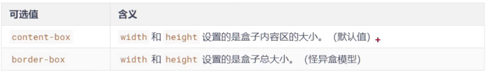
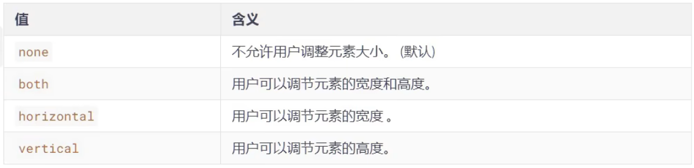
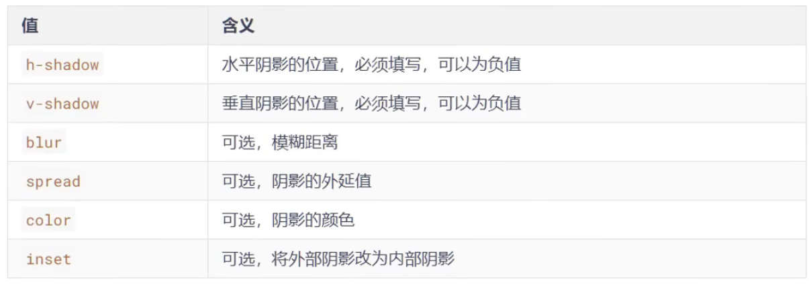

# 新增盒子属性

## 一、`box-sizing`怪异盒模型

使用`box-sizing`属性可以设置盒模型的两种类型




## 二、`resize`调整盒子大小

使用`resize`属性可以控制是否允许用户调节元素尺寸



**注意**：前提是写`resize:both`必须加上`overflow属性`，否则不生效，也是为了避免子盒子过大不知如何显示


## 三、`box-shadow`盒子阴影

使用`box-shadow`属性为盒子添加阴影

- 语法：

	```css
	box-shadow: h-shadow v-shadow blur spread(外延值，阴影放大) color inset
	```

- 各个值的含义：

	

- 默认值：`box-shadow:none`表示没有阴影

- 示例：

	```css
	/* 写两个值，含义：水平位置、垂直位置 */
	box-shadow: 10px 10px;
	
	/* 写三个值，含义：水平位置、垂直位置、颜色 */
	box-shadow: 10px 10px red;
	
	/* 写三个值，含义：水平位置、垂直位置、模糊值 */
	box-shadow: 10px 10px 10px;
	
	/* 写四个值，含义：水平位置、垂直位置、模糊值、颜色 */	常用
	box-shadow: 10px 10px 10px red;
	
	/* 写五个值，含义：水平位置、垂直位置、模糊值、外延值、颜色 */
	box-shadow: 10px 10px 10px 10px red;
	
	/* 写六个值，含义：水平位置、垂直位置、模糊值、外延值、颜色、内阴影 */
	box-shadow: 10px 10px 30px 3px blue inset;
	```

	

## 四、`opacity`不透明度

- `opacity`属性能为整个元素添加透明效果，值是 `0` 到 `1` 之间的小数，`0` 是完全透明，`1` 是完全不透明

	> `opacity`与`rgba`的区别？
	>
	> `opacity`是一个属性，设置的是整个元素（包括元素里的内容）的不透明度
	>
	> `rgba`是颜色的设置方式，用于设置颜色，它的不透明度，仅仅是调整颜色的透明度


