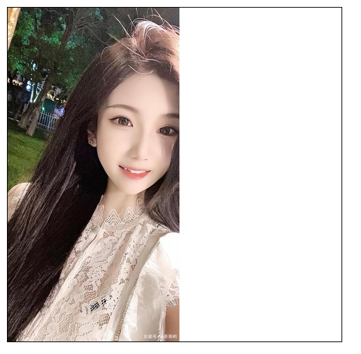
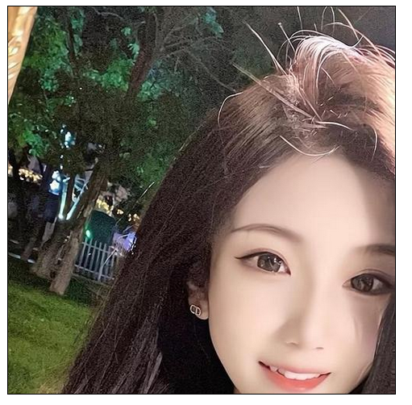

# 新增背景属性

## 一、`background-origin`背景原点

- 作用：设置背景图的原点
- 语法：
	1. `padding-box`：从`padding`区域开始显示背景图像。——默认值
	2. `border-box`：从`border`区域开始显示背景图像
	3. `content-box`：从`content`区域开始显示背景图像


## 二、`background-clip`背景外裁

- 作用：设置背景图的向外裁剪的区域

- 语法：

	- `border-box`：从`border`区域开始向外裁剪背景。——默认值
	- `padding-box`：从`padding`区域开始向外裁剪背景
	- `content-box`：从`content`区域开始向外裁剪背景
	- `text`：背景图只呈现在文字上

	> 注意：若值为`text`，那么设置文字必须是透明色才能显示 `color: transparent;`

	

## 三、`background-size`背景尺寸

- 作用：设置背景图的尺寸

- 语法：

	1. 用长度值指定背景图片的大小，不允许负值，可能会使图片变形

		```css
		background-size: 400px 400px;
		```

	2. 用百分比指定背景图片的大小，不允许负值，可能会使图片变形

		```css
		background-size: 100% 100%;
		```

	3. `auto`：背景图片的真实大小    —— 默认值

	4. `contain`：将背景图片等比例缩放，使背景图片的宽或高，与容器的宽或高相等，再将完整背景图片包含在容器内，但要注意：可能会造成容器里面部分区域没有背景图片

		```css
		background-size: contain;
		```

		 

  5.   `cover`：将背景图片等比例缩放，直到完全覆盖容器，图片会尽可能全的显示在元素上，但要注意：背景图片有可能显示不完整

	```css
	background-size: cover;
	```

	 


## 四、`background`复合属性

- 语法：

	```css
	background: color url repeat position / size origin clip
				颜色   地址  重复   位置       大小  原点   裁剪
	```

	> 注意：
	>
	> 	1. `origin`和`clip`的值如果一样，如果只写一个值，则`origin`和`clip`都设置；如果设置了两个值，前面的是`origin`，后面的是`clip`
	> 	1. `size`的值必须在`position`值的后面，并且用 `/` 分开


## 五、多背景图

**`CSS3`允许设置多个背景图片**

```css
/* 添加多个背景图片 */
background: url(../xxx/xx-1.png) no-repeat left top,
			url(../xxx/xx-2.png) no-repeat right top,
			url(../xxx/xx-3.png) no-repeat left bottom,
			url(../xxx/xx-4.png) no-repeat right bottom;
```


