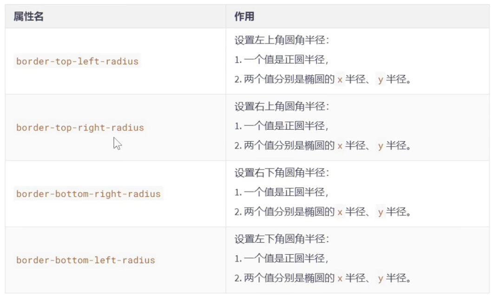

# 新增边框属性

## 一、边框圆角

- `CSS3`中，使用`border-radius`属性可以将盒子变为圆角

- 同时设置四个角的圆角：

	```css
	border-radius: 10px;
	```

- 分开设置每个角的圆角（几乎不用）：

	

- 分开设置每个角的圆角，综合写法（几乎不用）：

	```css
	border-radius: 左上角x 右上角x 右下角x 左下角x / 左上角y 右上角y 右下角y 左下角y
	```

	

## 二、边框外轮廓

- `outline-width`：外轮廓的宽度

- `outline-color`：外轮廓的颜色

- `outline-style`：外轮廓的风格

	- `none`：无轮廓
	- `dotted`：点状轮廓
	- `dashed`：虚线轮廓
	- `solid`：实线轮廓
	- `double`：双线轮廓

- `outline-offset`：设置外轮廓与边框的距离，正负值都可以设置

	> 注意：`outline-offset`不是`outline`的子属性，是一个独立的属性

- `outline`复合属性

	```css
	outline: 50px solid blue;
	```

注：外轮廓不参与盒子的占位，就像是盒子发出的光一样，在周围显示但不会占位也不影响盒子的大小


