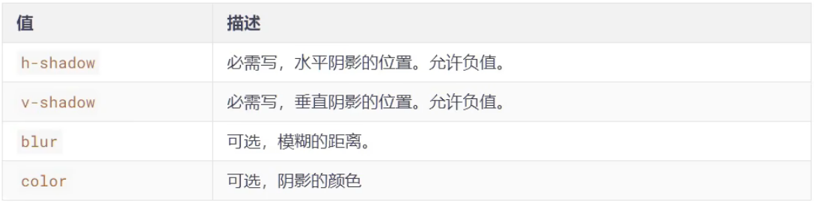
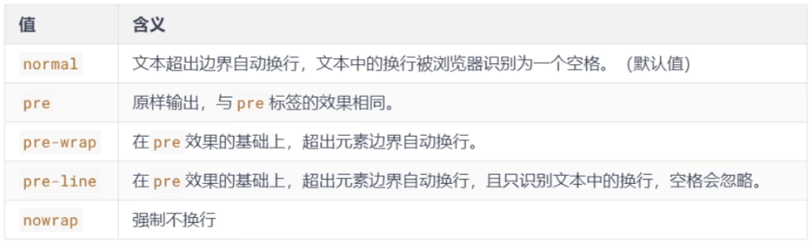
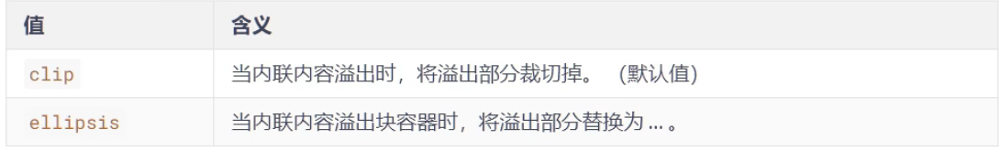

# 新增文本属性

## 一、文本阴影`text-shadow`

- 在`CSS3`中，我们可以使用`text-shadow`属性给文本添加阴影

- 语法：

	```css
	text-shadow: h-shadow v-shadow blur color;
	```

	

默认值：`text-shadow: none`表示没有阴影


## 二、文本换行`white-space`

- `CSS3`中，我们可以使用`white-space`属性设置文本换行方式

- 常用值如下

	

注：`pre-line`会忽略一行文字始末位置的空格，文字中的空格不会忽略


## 三、文本溢出`text-overflow`

- 在`CSS3`中，我们可以使用`text-overflow`属性设置文本内容溢出时呈现模式

- 与`overflow`类似，`overflow`处理**元素**溢出，`text-overflow`处理**文本**溢出

- 常用值如下：

	

> 注意：要使得`text-overflow`属性生效，块容器必须定义`overflow`为**非**`visible`值，`white-space`为`nowrap`值

```css
div {
    width: 400px;
    height: 400px;
    overflow: hidden;
    white-space: nowrap;		//强制不换行
    text-overflow: ellipsis		// ellipsis省略   超出部分省略
}
```


## 四、文本修饰`text-decoration`

- `CSS3`升级了`text-decoration`属性，让其变成了复合属性

	```css
	text-decoration: text-decoration-line || text-decoration-style || text-decoration-color
	```

- 子属性及其含义：

	- `text-decoration-line` 设置文本装饰线的位置
		- `none`：指定文字无装饰（默认值）
		- `underline`：指定文字的装饰是下划线
		- `overline`：指定文字的装饰是上划线
		- `line-through`：指定文字的装饰是贯穿线
	- `text-decoration-style` 文字装饰线条的形状
		- `solid`：实线（默认值）
		- `double`：双线
		- `dotted`：点状线条
		- `dashed`：虚线
		- `wavy`：波浪线
	- `text-decoration-color` 文本修饰线的颜色

```css
text-decoration: underline wavy red;
```


## 五、文本描边`text-stroke`

注意：文字描边功能仅`webkit`内核浏览器支持，需要加上`-webkit-`

- `-webkit-text-stroke-width`：设置文字描边的宽度，写长度值
- `-webkit-text-stroke-color`：设置文字描边的颜色，写颜色值
- `-webkit-text-stroke`：复合属性，设置文字描边宽度和颜色


