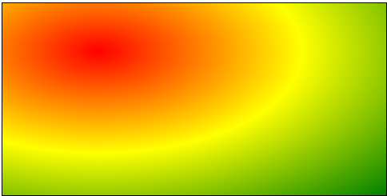

# `CSS3`新增颜色渐变

## 一、线性渐变`linear-gradient`

- 多个颜色之间，默认**从上往下**渐变

	> ```css
	> background-image: linear-gradient(red,yellow,green);
	> ```
	>
	>  

- 使用**关键词**设置线性渐变方向

	> ```css
	> //从下向上渐变
	> background-image: linear-gradient(to top, red,yellow,green);
	> //从左下向右上渐变
	> background-image: linear-gradient(to top right, red,yellow,green);
	> ```
	>
	>  

- 使用**角度**设置线性渐变方向

	> ```css
	> //以从下向上为基础顺时针旋转30度
	> background-image: linear-gradient(30deg, red,yellow,green);
	> ```
	>
	>  

- 调整开始渐变的位置

	> ```css
	> //从上往下，距离上部50px位置必须为红色，100px位置必须为黄色，150px位置必须为绿色，交接处发生渐变
	> background-image: linear-gradient(red 50px,yellow 100px,green 150px);
	> ```
	>
	>  


## 二、径向渐变`radial-gradient`

- 多个颜色之间的渐变，默认从圆心四散（注意：不一定是正圆，要看容器本身宽高比）

	> ```css
	> background-image: radial-gradient(red,yellow,green);
	> ```
	>
	>  

- 使用关键词调整渐变圆的圆心位置

	> ```css
	> background-image:radial-gradient(at left top,red,yellow,green);
	> ```
	>
	>  

- 使用像素值调整渐变圆的圆心位置

	> ```css
	> background-image:radial-gradient(at 100px 50px,red,yellow,green);
	> ```
	>
	>  

- 使用`circle`调整渐变圆形状为正圆

	> ```css
	> background-image:radial-gradient(circle,red,yellow,green);
	> ```
	>
	>  

- 调整渐变圆形状的半径

	> ```css
	> /* 设置渐变圆半为100px的正圆 */
	> background-image:radial-gradient(100px,red,yellow,green);
	> /* 设置渐变圆半为100px 50px的椭圆 */
	> background-image:radial-gradient(100px 50px,red,yellow,green);
	> ```
	>
	>   

- 调整渐变开始的位置

	> ```css
	> background-image:radial-gradient(red 50px,yellow 100px,green 150px);
	> ```
	>
	>  


## 三、重复渐变`repeating-`

重复渐变：在没有发生渐变的区域，重新开始渐变，就是重复渐变

- 线性重复渐变：

	```css
	background-image:repeating-linear-gradient(red 50px,yellow 100px,green 150px);
	```

	 

- 径向重复渐变：

	```css
	background-image:repeating-radial-gradient(red 50px,yellow 100px,green 150px);
	```

	 


