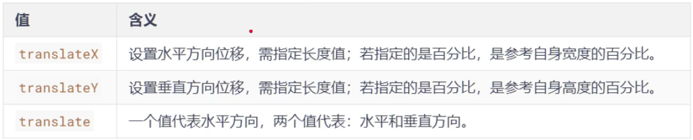
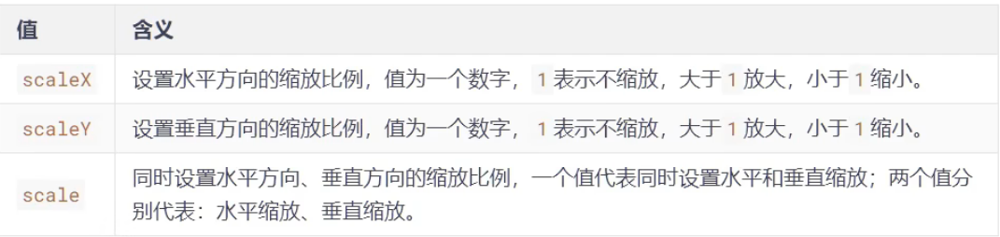
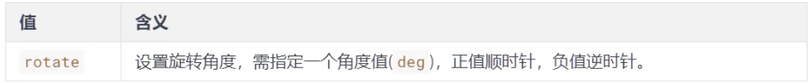
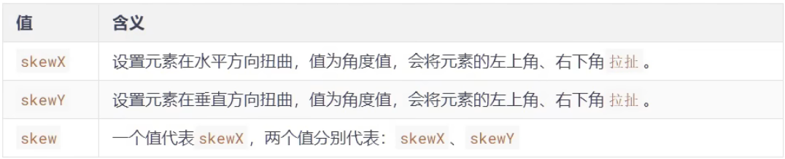

# `2D`变换

## 一、`2D`位移

`2D`位移可以改变元素的位置，具体方式如下：

1. 先给元素添加 **转换属性** `transform`

2. 编写`transform`的具体值，相关可选值如下：

	

3. 注意点：

	> 1. 位移与相对定位很相似，都不脱离文档流，不会影响到其他元素
	>
	> 2. 与相对定位的区别：相对定位的百分比值，参考的是其父元素；定位的百分比值，参考的是其自身
	>
	> 3. 浏览器针对**位移**有优化，与定位相比，浏览器处理位移的效率更高
	>
	> 4. `transform`可以链式编写，例如：
	>
	> 	```css
	> 	transform: translateX(30px) translateY(40px);
	> 	```
	>
	> 5. 位移对行内元素无效
	>
	> 6. 位移配合定位，可实现元素水平垂直居中
	>
	> 	```css
	> 	.box {
	> 	    position: absolute;
	> 	    left: 50%;
	> 	    top: 50%;
	> 	    transform:translate(-50%, -50%);
	> 	}
	> 	```


## 二、`2D`缩放

`2D`缩放是指：让元素放大或缩小，具体使用方式如下：

1. 先给元素添加 **转换属性** `transform`

2. 编写`transform`的具体值，相关可选值如下：

	

3. 注意点：

	> 1. `scale`的值，是支持写负数的，但几乎不用，因为容易让人产生误解
	>
	> 2. 借助缩放，可以实现小于`12px`的文字


## 三、`2D`旋转

`2D`旋转是指：让元素在二维平面内，顺时针旋转或逆时针旋转，具体方式如下：

1. 先给元素添加 **转换属性** `transform`

2. 编写`transform`的具体值，相关可选值如下：

	

​		    `rotateZ`			|    设置`2D`平面上的旋转角度

> 注意：`rotateZ(20deg)`相当于`rotate(20deg)`，当然学到了`3D`变换的时候，还能写：`rotate(x,x,x)`


## 四、`2D`扭曲

`2D`扭曲是指：让元素在二维平面内被“拉扯”，进而“走形”，实际开发几乎不用，了解即可，具体使用方式如下：

1. 先给元素添加 **转换属性** `transform`
2. 编写`transform`的具体值，相关可选值如下：    


## 五、多重变换

多个变换，可以同时使用一个`transform`来编写

```css
transform: translate(-50%, -50%) rotate(45deg);
```

> 注意：多重变换时，建议旋转放在最后，因为旋转会破坏坐标系


## 六、变换原点

- 元素变换时，默认的原点是元素中心，使用`transform-origin`可以设置变换的原点

- 修改变换原点对**位移**没有影响，对**旋转**和**缩放**会产生影响

- 如果提供两个值，第一个用于横坐标，第二个用于纵坐标

- 如果提供一个值，若是像素值，表示横坐标，纵坐标取`50%`；若是关键字，则另一个坐标取`50%`

	> 1. `transform-origin: 50% 50%`，变换原点在元素的中心位置，百分比是相对于自身 —— 默认值
	> 2. `transform-origin: left top`，变换原点在元素的左上角
	> 3. `transform-origin: 50px 50px`，变换原点距离元素左上角`50px 50px`的位置
	> 4. `transform-origin: 0`，只写一个值的时候，第二个值默认为`50%`


