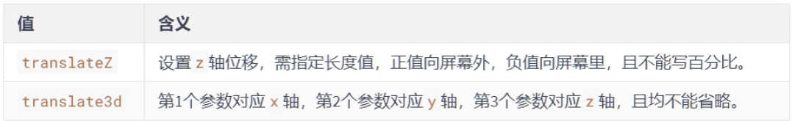

# `3D`变换

## 一、开启`3D`空间

重要原则：元素进行`3D`变换的首要操作：**==父元素==**必须开启`3D`空间！

> 使用`transform-style`开启`3D`空间，可选值如下：
>
> - `flat`：让子元素位于此元素的二维平面内（`2D`空间）—— 默认值
> - `preserve-3d`：让子元素位于此元素的三维空间内（`3D`空间）


## 二、设置景深

何为景深？——指定观察者与`z=0`平面的距离，能让发生`3D`变换的元素，产生透视效果，看起来更立体，即近大远小

> 使用`perspective`设置景深，可选值如下：
>
> - `none`：不指定透视——（默认值）
> - `长度值`：指定观察者距离`z=0`平面的距离，不允许负值
>
> 注意：`perspective`设置给发生`3D`变换元素的**==父元素！==**


```css
/* 开启3D空间 */
transform-style: preserve-3d;
/* 设置景深（有了透视效果，近大远小） */
perspective: 500px;
```


## 三、透视点位置

所谓透视点位置，就是观察者位置；默认透视点在元素的中心

> 使用`perspective-origin`设置观察者位置（透视点的位置），例如：
>
> ```css
> /* 设置透视点位置（观察者位置） */
> /* 相对坐标轴往右偏移400px，往下偏移300px（相当于人蹲下300px，然后向右移400px看元素） */
> perspective-origin: 400px 300px;
> ```
>
> 注意1：通常情况下，我们不需要调整透视点位置
>
> 注意2：调整透视点位置是给发生`3D`变换元素的**==父元素！==**


## 四、`3D`位移

`3D`位移是在`2D`位移基础上，可以让元素沿`z`轴位移，具体使用方式如下：

1. 先给元素添加 **转换属性** `transform`
2. 编写`transform`的具体值，`3D`相关可选值如下：


## 五、`3D`旋转

`3D`旋转是在`2D`旋转的基础上，可以让元素沿`x`轴和`y`轴旋转，具体使用方式如下：

1. 先给元素添加 **转换属性** `transform`

2. 编写`transform`的具体值，`3D`相关可选值如下：

	


## 六、`3D`缩放

`3D`缩放是在`2D`旋转的基础上，可以让元素沿`z`轴缩放，具体使用方式如下：

1. 先给元素添加 **转换属性** `transform`

2. 编写`transform`的具体值，`3D`相关可选值如下：

	

>  注意：`scaleZ`缩放的是厚度，但元素没有厚度，因此会去影响景深的大小（`scaleZ(4)`相当于`perspective/=4`）


## 七、多重变换

多个变换，可以同时使用一个`transform`来编写

```css
transform: translateZ(100px) scaleZ(3) rotateY(40deg);
```

> 注意点：多重变换时，建议最后旋转


