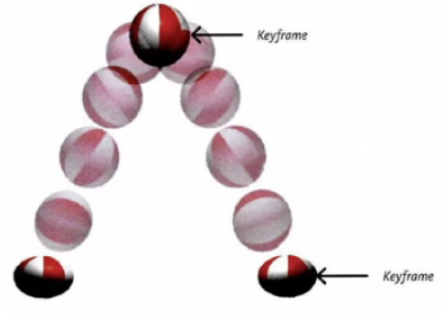

# `CSS3`动画

## 一、什么是帧

- 一段动画，就是一段时间内连续播放`n`个画面。每一张画面，我们管他叫做“帧”。一定时间内连续快速播放若干个帧，就成了人们眼中的动画。同样时间内，播放的帧数越多，画面看起来越流畅


## 二、什么是关键帧

- 关键帧指的是，在构成一段若干个帧中，起到决定性作用的`2~3`帧

 


## 三、动画的基本使用

- 第一部：定义关键帧（定义动画）

	1. 简单方式定义：

		```css
		/* 写法一 */
		@keyframes 动画名 {
		    from {
				/* 第一帧 */
		        background-color: yellow;
		    }
		    to {
		        /* 最后一帧 */
		        background-color: blueviolet;
		        transform: translate(900px) rotate(360deg);
		    }
		}
		```

	2. 完整方式定义：

		```css
		@keyframes 动画名 {
		    /* 分成多段定义，更加细化 */
		    0% {
		        background-color: aqua;
		    }
		    33% {
		        background-color: blueviolet;
		    }
		    66% {
		        background-color: brown;
		    }
		    100% {
		        background-color: skyblue;
		        border-radius: 50%;
		        transform: translate(900px) rotate(360deg);
		    }
		}
		```

- 第二步：给元素应用动画，用到的属性如下：

	1. `animation-name`：给元素指定具体的动画

	2. `animation-duration`：设置动画所需时间

	3. `animation-delay`：设置动画延迟

		```css
		/* 动画名 */
		animation-name: textKey;
		/* 动画时长 */
		animation-duration: 3s;
		/* 动画延迟 */
		animation-delay: 0.5s;
		```

注意：百分比写法和`from..to..`写法可以混合着写，没有问题。但是建议不要混合写，保持代码清晰明了


## 四、动画的其他属性

- `animation-timing-function`，设置**动画的类型**，常用值如下：

	> 1. `ease`：平滑动画（慢、快、慢）——默认值
	> 2. `linear`：线性动画（匀速）
	> 3. `ease-in`：缓慢进入（慢、快）
	> 4. `ease-out`：缓慢出去（快、慢）
	> 5. `ease-in-out`：缓慢进出（慢、快、慢）（比`ease`更慢、更快、更慢）
	> 6. `step-start`：不考虑动画时间，直接到达终点，相当于`steps(1, start)`
	> 7. `step-end`：考虑动画时间，但无过渡效果，过渡时间一到，瞬间到达终点，相当于`steps(1, end)`
	> 8. `steps(integer, start/end)`：均匀的分成`integer`步完成此动画
	> 	- `integer`：必须为正整数，指定函数的步数
	> 	- `start/end`：参数取值可以是`start`或`end`，指定每一步发生的时间点，默认值为`end`		
	> 9. `cubic-bezie(number,number,number,number);`   特定的**贝塞尔曲线类型**

	注：在线制作贝塞尔曲线：https://cubic-bezier.com

- `animation-iteration-count`，指定动画**播放次数**，常用值如下：

	> 1. `number`：具体数值，动画循环次数
	> 2. `infinite`：无限循环

- `animation-direction`，指定**动画方向**，常用值如下：

	> 1. `normal`：正常方向（默认）
	> 2. `reverse`：反方向运行
	> 3. `alternate`：动画先正常运行再反方向运行，并持续交替运行
	> 4. `alternate-reverse`：动画先反方向运行再正方向运行，并持续交替运行

- `animation-fill-mode`，设置**动画之外的状态**（动画结束时停留的位置）

	> 1. `forwards`：设置对象状态为动画**结束时**的状态
	> 2. `backwards`：设置动画状态为动画**开始时**的状态

	注：想设置此属性生效，就不能设置动画无限循环

- `animation-play-state`，设置动画的**播放状态**，常用值如下：

	> 1. `running`：运动（默认）
	> 2. `paused`：暂停


## 五、动画复合属性

只设置一个时间表示`duration`，设置两个时间分别是：`duration`和`delay`，其他属性没有数量和顺序要求

```css
/* 复合属性 */
animation: 动画名 3s 0.5s linear 2 alternate-reverse forwards;
       /* 名称 运行时间 延迟 匀速  次数  先反再正反复运行  停在最后一帧 */
```

> 备注：`animation-play-state`（播放状态）一般单独使用


