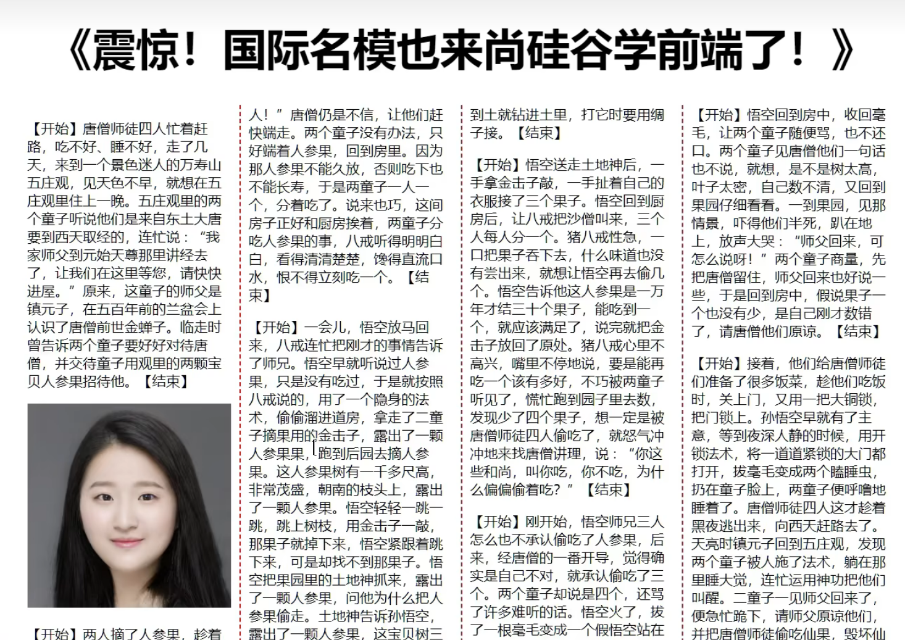

# 多列布局

- 作用：专门用于实现类似于报纸的布局

- 常用属性如下：
	- `column-count`：指定列数，值是数字
	- `column-width`：指定列宽，值是长度
	- `columns`：同时指定列宽和列数，复合属性；值没有数量和顺序要求
	- `column-gap`：设置列边距，值是长度
	- `column-rule-style`：设置列与列之间边框的风格，值与`border-style`一致
	- `column-rule-width`：设置列与列之间边框的宽度，值是长度
	- `column-rule-color`：设置列与列之间边框的颜色
	- `column-rule`：设置列边框，复合属性，与`border`一样
	- `column-span`：指定是否跨列；值：`none`、`all`

- 注意：`column-span`一般给标题单独使用，需要单独找到包裹标题的标签设置该属性

- 示例：     

