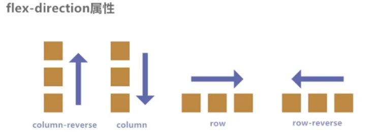
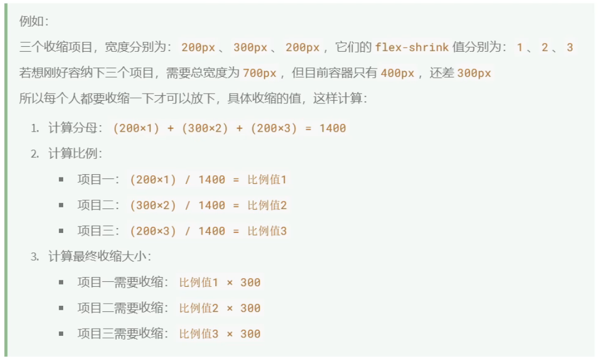

# 伸缩盒模型

## 一、伸缩盒模型简介

- 2009年，`W3C`提出了一种新的盒子模型 —— `Flexible Box` （伸缩盒模型，又称：弹性盒子）

- 它可以轻松的控制：元素分布方式、元素对齐方式、元素视觉顺序 ......
- 截止目前，除了部分`IE`浏览器不支持，其他浏览器均已全部支持
- 伸缩盒模型的出现，逐渐演变出了一套新的布局方案 —— `flex`布局

> 小贴士：
>
> 1. 传统布局是指：基于传统盒状模型，主要靠：`display`属性+`position`属性+`float`属性
> 2. `flex`布局目前在移动端应用的比较广泛，因为传统布局不能很好的呈现在移动设备上


## 二、伸缩容器、伸缩项目

- 伸缩容器：开启了`flex`的元素，就是伸缩容器

	> 1. 给元素设置：`display: flex` 或 `display: inline-flex`，该元素就变成为了伸缩容器
	> 2. `display：inline-flex`很少使用，因为可以给多个伸缩容器的父容器，也设置为伸缩容器
	> 3. 一个元素可以同时是：伸缩容器，伸缩项目

- 伸缩项目：伸缩容器所有**==子元素==**自动成为了：伸缩项目

	> 1. 仅伸缩容器的**==子元素==**成为了伸缩项目，孙子元素、重孙子元素等后代，不是伸缩项目
	> 2. 无论原来是哪种元素（块、行内块、行内），一旦成为了伸缩项目，全都会“块状化”


## 三、主轴与侧轴

- 主轴：伸缩项目沿着主轴排列，主轴默认是水平的，默认方向是：从左到右（左边是起点，右边是终点）
- 侧轴：与主轴垂直的就是侧轴，侧轴默认是垂直的，默认方向是：从上到下（上边是起点，下边是终点）


## 四、主轴方向`flex-direction`

- 属性名：`flex-direction`

- 常用值如下：

	 1.  `row`：主轴方向水平从左往右 —— 默认值

	 2.  `row-reverse`：主轴方向水平从右往左

	 3.  `column`：主轴方向垂直从上到下

	 4.  `column-reverse`：主轴方向垂直从下到上

		 

> 注意：改变了主轴的方向，侧轴方向也随之改变


## 五、主轴换行方式`flex-wrap`

- 属性名：`flex-wrap`

- 常用值如下：

	 1.  `nowrap`：默认值，不换行

		 

	 2.  `wrap`：自动换行，伸缩容器不够自动换行

		 

	 3.  `wrap-reverse`：反向换行

		 

注意：如果发生换行侧轴方向很大，会与前面的元素留空


## 六、主轴方向和换行方式复合属性`flex-flow`

- `flex-flow`是一个复合属性，复合了`flex-direction`和`flex-wrap`两个属性，值顺序没有要求

	```css
	flex-flow: row wrap;
	```

	

## 七、主轴对齐方式`justify-content`

- 属性名：`justify-content`
- 常用值如下：
	1. `flex-start`：主轴起点对齐 —— 默认值
	2. `flex-end`：主轴终点对齐
	3. `center`：居中对齐
	4. `space-between`：均匀分布，两端对齐（最常用）
	5. `space-around`：均匀分布，两端距离是中间距离的一半
	6. `space-evenly`：均匀分布，两端距离与中间距离一致

- 图示：默认主轴从左往右

​		 


## 八、侧轴对齐方式

### 1、只有一行的情况`align-items`

- 所需属性：`align-items`

- 常用值如下：

	1. `flex-start`：侧轴起点对齐
	2. `flex-end`：侧轴终点对齐
	3. `center`：侧轴中点对齐
	4. `baseline`：伸缩项目的第一行文字的基线对齐
	5. `stretch`：如果伸缩项目未设置高度，将占满整个容器的高度，设置高度以高度为准 —— （默认值）

	 

	 


### 2、多行的情况`align-content`

- 所需属性：`align-content`

- 常用值如下：

	1. `flex-start`：与侧轴起点对齐
	2. `flex-end`：与侧轴终点对齐
	3. `center`：与侧轴中点对齐
	4. `space-between`：与侧轴两端对齐，中间均匀分布
	5. `space-around`：伸缩项目间距离相等，两端距离是中间距离的一半
	6. `space-evenly`：在侧轴上完全平分
	7. `stretch`：占满整个侧轴 —— 默认值

	 

	 

	 

	 


## 九、主轴方向的基准长度`flex-basis`

- 概念：`flex-basis`设置的是主轴方向的**基准长度**，会让宽度或高度失效

	> 备注：主轴横向：宽度失效；主轴纵向：高度失效

- 作用：浏览器根据这个属性设置的值，计算主轴上是否有多余空间，默认值`auto`，即：伸缩项目的宽或高


## 十、伸缩项目——伸的体现`flex-grow`

- 概念：`flex-grow`定义伸缩项目的放大比例，默认是`0`，即：纵使主轴存在剩余空间，也不拉伸（放大）
- 规则：
	1. 若所有伸缩项目的`flex-grow`值都为1，则：它们将等分剩余空间（如果有空间的话）
	2. 若三个伸缩项目的`flex-grow`值分别为`1、2、3`，则它们瓜分到：`1/6、2/6、3/6`的空间


## 十一、伸缩项目——缩的体现`flex-shrink`

- 概念：`flex-shrink`定义了项目的压缩比例，默认是`1`，即：如果空间不足，该项目将会缩小

- 收缩项目的计算，略微复杂一点，我们拿一个场景举例：

	

- 注意：收缩到最小值也能显示其内容区，不会将内容区收缩没


## 十二、`flex`复合属性

`flex`是复合属性，复合了：`flex-grow`、`flex-shrink`、`flex-basis`三个属性，默认值为`0 1 auto`

- 如果写`flex: 1 1 auto`，则可简写为：`flex: auto`		拉伸 压缩 基准长度自动
- 如果写`flex: 1 1 0`，则可简写为：`flex: 1`		拉伸 压缩 基准长度为0
- 如果写`flex: 0 0 auto`，则可简写为：`flex: none`   		不拉伸 不压缩 基准长度自动
- 如果写`flex: 0 1 auto`，则可简写为：`flex: 0 auto` —— 即`flex`初始值			不拉伸 压缩 基准长度自动


## 十三、项目排序

- `order`属性定义项目的排列顺序，数值越小，排列越靠前，默认值为`0`


## 十四、单独对齐

- 通过`align-self`属性，可以**单独**调整某个伸缩项目的对齐方式（在侧轴的对齐方式）
- 默认值为`auto`，表示继承父元素的`align-items`属性


 


