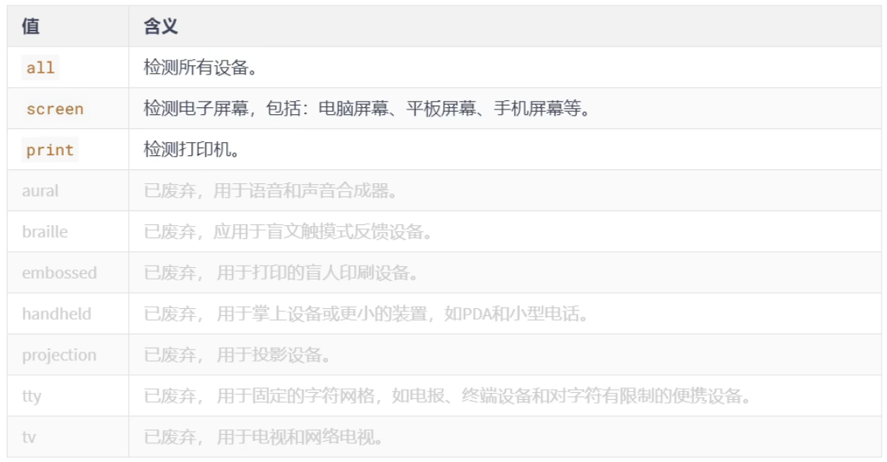
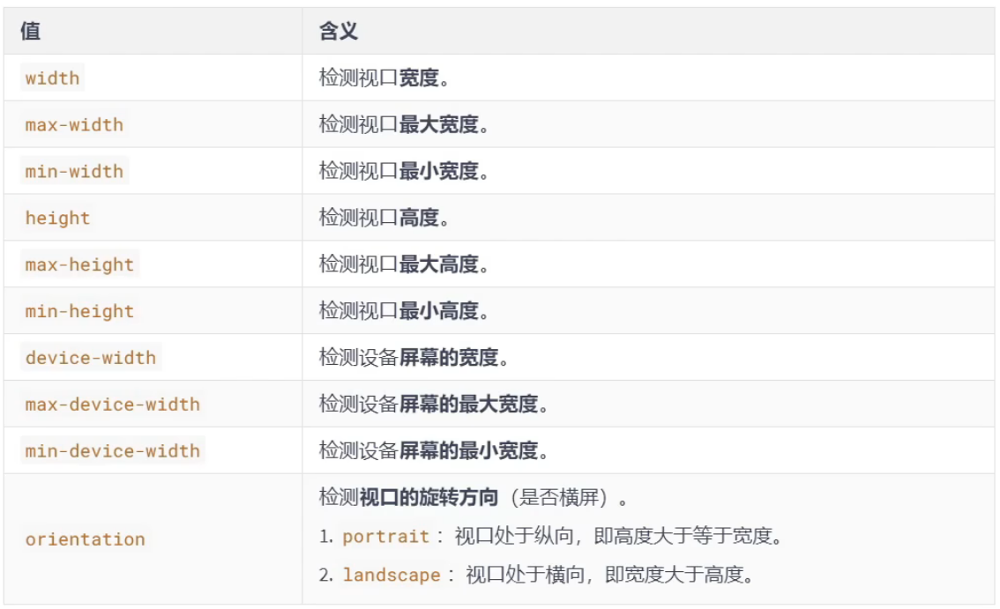
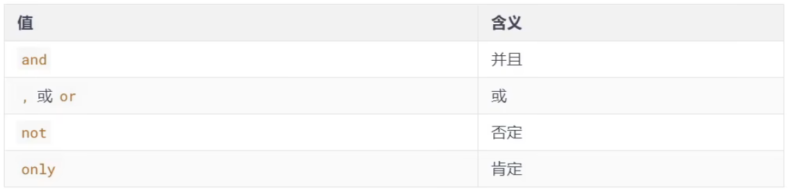
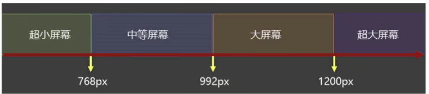

# 响应式布局

## 一、媒体类型



> 完整列表请参考：https://developer.mozilla.org/zh-CN/docs/Web/CSS/@media

```css
/* 打印时的样式 */
@media print {
    div {
        background: transparent;
    }
}
/* 屏幕上显示的样式 */
@media screen {
    div {
        background: yellow;
    }
}
```


## 二、媒体特性



```css
/* 检测视口的宽度小于等于800px时，应用如下样式 */
@media (max-width: 800px) {
    div {
        background-color: red;
    }
}
/* 检测视口是否处于纵向，若纵向，应用如下样式 */
@media (orientation: portrait) {
    div {
        background-color: yellow;
    }
}
/* 检测设备屏幕的宽度小于等于800px时，应用如下样式 */
@media (max-device-width: 800px) {
    div {
        background-color: blue;
    }
}
```

注意：`media`后面要加`()`包裹 


## 三、运算符



```css
/* 检测视口是否为屏幕，并且视口最大宽度小于等于600px或视口最小宽度大于等于800px时，应用如下样式 */
@media screen and (max-width: 600px) or (min-width: 800) {
    div {
        background-color: yellow;
    }
}
```


## 四、常见阈值

在实际开发中，会将屏幕划分成几个区间，例如：

 


## 五、结合外部样式的用法

**用法一：**

```css
/* 只有符合视口为屏幕且视口最小宽度为1200px才引入huge.css中的样式 */
<link rel="stylesheet" media="screen and (min-width: 1200px)" href="./css/huge.css">
```

```css
/* 外部huge.css内容 */
div {
    background-color: purple;
}
```


**用法二：**

```css
/* 外部middle.css内容 */
@media screen and (min-width: 768px) and (max-width: 992px) {
    div {
        background-color: red;
    }
}  
```


