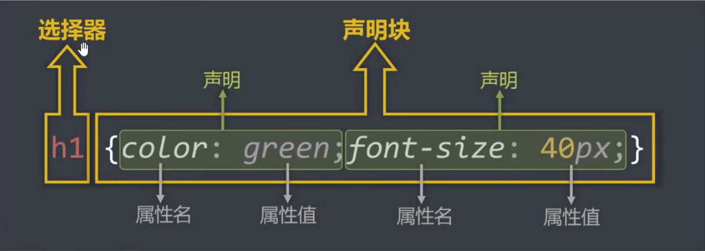

# `CSS`基础

## 一、`CSS`简介

- `CSS`全称：层叠样式表（`Cascading Style Sheets`）
- `CSS`是一种标记语言，用于给`HTML`结构设置样式，例如：文字大小、颜色、元素宽高等等

> 简单理解：`CSS`可以美化`HTML`，让`HTML`更漂亮
>
> 核心理解：`HTML`搭建结构，`CSS`添加样式，实现了：结构样式的分离


## 二、`CSS`编写位置

### 1、行内样式

- 写在标签`style`属性中（又称内联样式）
- 语法：

```html
<body>
    <!-- CSS行内样式 -->
    <h1 style="color: red;font-size: 80px;">欢迎学习CSS</h1>
</body>
```

`font-size`：表示字体大小，单位像素px

- 注：

	> 1. `style`属性的值不能随便写，要符合`CSS`语法规范，是`名:值;`的形式
	> 2. 行内样式表，只能控制当前标签的样式，对其他标签无效

- 存在的问题：

	> 书写繁琐，样式不能复用，并且没有体现出：**结构与样式分离**的思想，不推荐大量使用，只有对当前元素添加简单样式时，才偶尔使用


### 2、内部样式

- 写在`html`页面内部，将所有的`CSS`代码提取出来，单独放在`<style>`标签中

- 语法：

	```html
	<head>
	    <style>
	        h1{
	            color: aqua;
	            font-size: 40px;
	        }
	        p{
	            color:hotpink;
	            font-size: 80px;
	        }
	        img{
	            width: 200px;
	        }
	    </style>
	</head>
	```

- 注意点：

  > 1. `<style>`标签理论上可以放在`html`文档的任何地方，但一般都放在`<head>`标签中
  > 2. 此种写法：样式可以复用，代码结构清晰
  > 3. 在`<style>`标签中`px`单位必须要带，不带则没有效果

- 存在的问题：

	> 1. 并没有实现：结构与样式**完全分离**
	>
	> 2. 多个`html`页面无法复用


### 3、外部样式

- 写在单独的`.CSS`文件中，随后在`html`文件中引入使用

- 语法：

	- 新建一个扩展名为`.CSS`的样式文件，把所有`CSS`代码都放在此文件中

		```html
		h1{
		    color: pink;
		    font-size: 40px;
		}
		```

	- 在`html`文件中引入`.CSS`文件

		```html
		<head>
		    <meta charset="UTF-8">
		    <title>CSS外部样式</title>
		    <link rel="stylesheet" href="./xxx.css">
		</head>
		```

- 注意点：

	> 1. `<link>`标签要写在`<head>`标签中
	> 2. `<link>`（联系）标签属性说明：
	> 	- `rel`：（`relation`关系   `stylesheet`：样式表）说明引入的文档与当前文档的关系
	> 	- `href`：引入的文档来自于哪里
	> 3. 外部样式表的优势：样式可以复用、结构清晰、可触发浏览器的缓存机制，提高访问速度，实现了**结构与样式完全分离**
	> 4. 在实际开发中，几乎都使用外部样式，这是最推荐的使用方法!


### 4、样式表的优先级

.bmp)


## 三、`CSS`语法规范

- **选择器**：找到要添加样式的元素

- **声明块**：设置具体的样式（声明块是由一个或多个声明组成的），声明的格式为：`属性名:属性值;`

	> **备注**1：最后一个声明后的分号理论上能省略，但是最好还是写上
	>
	> **备注**2：选择器与声明块之间，属性名与属性值之间，均有一个空格，理论上能省略，但最好还是写上

​	

- **注释的写法**：

	```css
	/* 给h2添加样式 */
	h2 {
	    /* 设置文字颜色为天蓝色 */
	    color: aqua;
	    /* 设置文字大小为80px */
	    font-size: 80px;
	}
	
	```

	

## 四、`CSS`代码风格

- **展开风格**——开发时推荐，便于维护和调试

	```css
	h1 {
	    color: pink;
	    font-size: 40px;
	} 
	```

- **紧凑风格**——项目上线时推荐，便于减小文件体积

	```css
	h1{color:pink;font-size:40px;} 
	```

- 备注：

	> 项目上线时，我们会通过工具将【展开风格】的代码，变成【紧凑风格】，这样可以减小文件的体积，节约网络流量，同时也能让用户打开网页时速度更快


