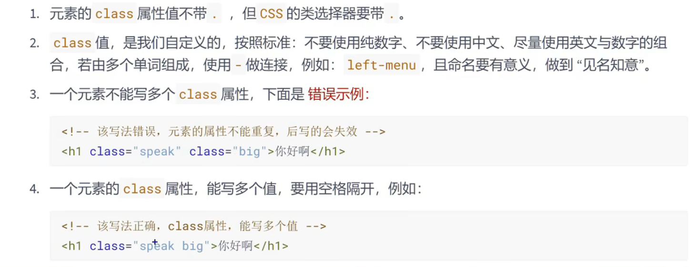
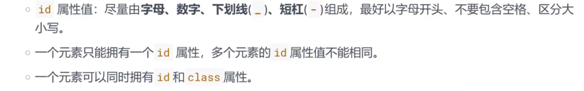
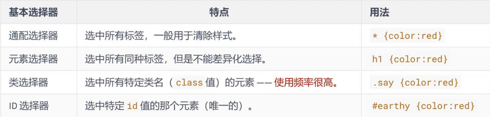

# `CSS`基本选择器

1. 通配选择器
2. 元素选择器
3. 类选择器
4. `id`选择器

## 1、通配选择器

- 作用：可以选中**所有**的`html`元素

- 语法：

	```css
	  		/* CSS通配选择器 */
	        * {
	            /* 属性名:属性值; */
	            color: pink;
	        }
	```

	下面的内容就全部都会变成粉色

```html
 	<h1>hello</h1>
    <h2>哈哈哈哈</h2>
    <h3>你好呀</h3>
    <p>啪啪啪</p>
    <p>欢迎来到饥荒！！！</p>
```

> 目前来看，**通配选择器**貌似有些鸡肋，但后面清除样式时，会对我们有很大帮助，后面会详细讲


## 2、元素选择器

- 作用：为页面中 **某种元素** 统一设置样式

- 语法：

	```css
		/* CSS元素选择器 */
	        h1 {
	            color: blue;
	        }
	        p {
	            font-size: 40px;
	        }
	```

- 注：元素选择器无法实现**差异化设置**，例如上面代码中，所有的`p`元素效果都一样


## 3、类选择器

- 作用：根据元素`class`值，来选中**某些**元素

	> `class`翻译有**种类、类别**的含义，所以`class`值，又称：类名

- 语法：

	```
	.类名 {
		属性名: 属性值;
	}
	```

```css
	/* CSS类选择器 */
	/* 选中class类值为papa的元素 */
        .papa {
            color: red;
        }
	/* 选中class类值为jihuang的元素 */
        .jihuang {
            color: orange;
            font-size: 80px
        }
	/* 选中class类值为small的元素 */
        .small {
            font-size: 10px;
        }
```

```html
	<h3 class="papa">你好呀</h3>
    <p class="papa small">啪啪啪</p>
    <p class="jihuang">欢迎来到饥荒！！！</p>
```

- 注意点：

	


## 4、`ID`选择器

- 作用：根据元素`id`属性值，来精准的选中**某个**元素

- 语法：

	```
	#id值 {
		属性名: 属性值;
	}
	```

	```css
			/* CSS ID选择器 */
			/* 选中ID值为hh的元素 */
	        #hh {
	            color: aquamarine;
	        }
	        /* 选中ID值为xx的元素 */
	        #xx {
	            color: blueviolet;
	        }
			/* 选中class值为xixi的那个元素 */
	        .xixi {
	            font-size: 50px;
	        }
	```

	```html
		<h2 id="hh">哈哈哈哈</h2>
	    <h2 id="xx" class="xixi">嘻嘻嘻嘻</h2>
	```

- 注意：

	


## 5、基本选择器总结




