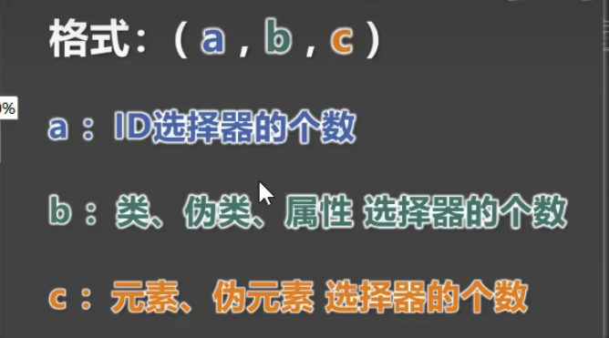
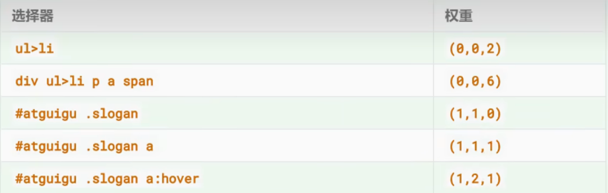

# `CSS`选择器优先级

通过==不同的选择器==，选中==相同的元素==，并且为==相同的样式名==设置==不同的值==时，就发生了样式冲突。

到底应用那个样式，此时就需要看==优先级==了

- 简单描述：

	> （行内样式>）`ID`选择器>类选择器=属性选择器>元素选择器>通配选择器

- 举例：

	```css
	        /* ID选择器>类选择器=属性选择器>元素选择器>通配选择器 */
	        h2 {
	            color: aqua;
	        }
	        * {
	            color: bisque;
	        }
	        #nb {
	            color: blue;
	        }
	        .gender {
	            color: green;
	        }
	        [title] {
	            color: yellow;
	        }
	```

	```html
	    <h2 class="gender" title="wushu" id="nb">天下武功，唯快不破</h2>
	```

	


- 复杂描述

	计算方式：每个选择器都可计算出一组权重，格式为（a,b,c）

		

- 举例：

	

- 比较规则：从==左往右==的顺序，依次比较大小，当前位胜出后，后面的不再对比
- 特殊规则：
	- **行内样式**权重大于**所有选择器**
	- ==`!important`==的权重，大于**行内样式**，大于**所有选择器**，**权重最高**


