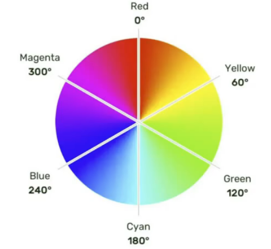

# `CSS`颜色表示

## 一、表示方式一：颜色名

- 编写方式：直接使用颜色对应的英文单词，编写比较简单，例如：

	- 红色：`red`

	- 绿色：`green`

	- 蓝色：`blue`

	- 紫色：`purple`

	- 橙色：`orange`

	- 灰色：`gray`

		......

	> 1. 颜色名这种方式，表达的颜色比较单一，所以用的并不多
	>
	> 2. 具体颜色名参考`MDN`官方文档：
	>
	> 	[颜色名大全](https://developer.mozilla.org/zh-CN/docs/Web/CSS/named-color)


## 二、颜色表示二：`rgb`或`rgba`

- 编写方式：使用**红、绿、蓝**这三种光的三原色进行组合
	- `r`表示红色
	- `g`表示绿色
	- `b`表示蓝色
	- `a`表示透明度

- 举例：

	```css
	        /* 使用0~255之间的数字表示一种颜色 */
			/* 红色 */
	        color:rgb(255,0,0);
	        /* 绿色 */
	        color: rgb(0,255,0);
	        /* 蓝色 */
	        color: rgb(0,0,255);
	        /* 黑色 */
	        color: rgb(0,0,0);
	        /* 白色 */
	        color: rgb(255,255,255);
	
			/* 混合出任意一种颜色 */
	        /* 紫罗兰色 */
	        color: rgb(138,43,226);
	        /* 半透明红色 */
	        color: rgba(255,0,0,0.5);
	
	        /* 也可以用百分比表示一种颜色（用的少） */
	        /* 红色 */
	        color: rgb(100%,0%,0%);
	        /* 半透明红色 */
	        color: rgba(100%,0%,0%,50%);
	```

- 小规律：

	> 1、若三种颜色值相同，呈现的是灰色，值越大，灰色越浅
	>
	> 2、`rgb(0,0,0)`是黑色，`rgb(255,255,255)`是白色
	>
	> 3、对于`rgba`来说，前三位的`rgb`形式保持一致，要么都是`0~255`的数字，要么都是`百分比`


## 三、颜色表示三：`HEX`或`HEXA`

`HEX`的原理同与`rgb`一样，依然是通过：**红、绿、蓝**进行组合，只不过要用**6个数字**，**分成3组**来表示，格式为：`#rrggbb`

> 每一位数字的取值范围是：`0~f`，即（`0，1，2，3，4，5，6，7，8，9，a，b，c，d，e，f`）
> 所以每一种光的最小值是：00，最大值是：`ff`
> 透明值范围：`00~ff`

```css
        /* 红色 */
        color: #ff0000;
        /* 绿色 */
        color: #00ff00;
        /* 蓝色 */
        color: #0000ff;
        /* 黑色 */
        color: #000000;
        /* 白色 */
        color: #ffffff;

        /* 混合出任意一种颜色 */
        color: #3f69a6;
        /* 半透明红色 */
        color: #ff000077;

        /* 如果没种颜色的两位都是相同的，就可以简写 */
        color: #ff9988;
        /* 可以简写为: */
        color: #f98;

        /* 但要注意前三位简写了，那么透明度就也要简写 */
        color: #ff998866;
        /* 可以简写为: */
        color: #f986;
```

> 注意：`IE`浏览器不支持`HEXA`,但支持`HEX`


## 四、颜色表示四：`HSL`或`HSLA`

- `HSL`是通过：色相、饱和度、亮度，来表示一个颜色，格式为：`hsl(色相，饱和度，亮度)`

	- 色相：取值范围是`0~360`度，具体度数对应的颜色如下图：

			

	- 饱和度：取值范围是：`0%~100%`（向色相中对应的颜色中添加灰色，`0%`全灰，`100%`没有灰）

	- 亮度：取值范围是`0%~100%`（`0%`亮度没了，所以就是黑色。`100%`亮度太强，所以就是白色）

- `HSLA`其实就是在`HSL`的基础上，添加了透明度

- 举例：

	```css
	        /* 红色 */
	        color: hsl(0, 100%, 50%);
	        /* 半透明红色 */
	        color: hsla(0, 100%, 50%, 0.5);
	```

	

​	


