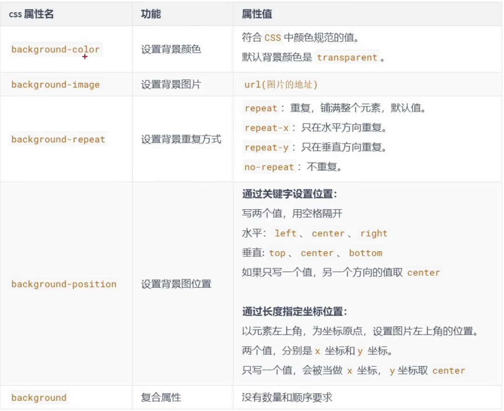

# CSS背景属性



- 举例：

	```css
	    div {
	        /* 设置背景颜色，默认值是transparent(透明色) */
	        background-color: purple;
	        /* 设置背景图片 */
	        background-image: url("./佳强老婆30.jpg");
	        /* 设置背景图片重复方式 */
	        background-repeat: no-repeat;
	        /* 控制背景图片位置————第一种写法：用关键词 */
	        background-position: right bottom;
	        /* 控制背景图片位置————第二种写法：用具体的像素值 */
	        background-position: 150px 100px;
	        /* 背景复合属性 */
	        background: green url("./佳强老婆29.jpg") no-repeat 100px 120px;
	    }
	```

	