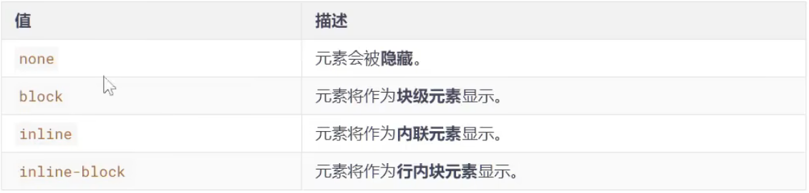
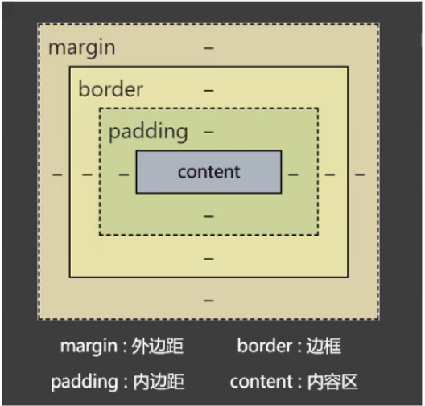
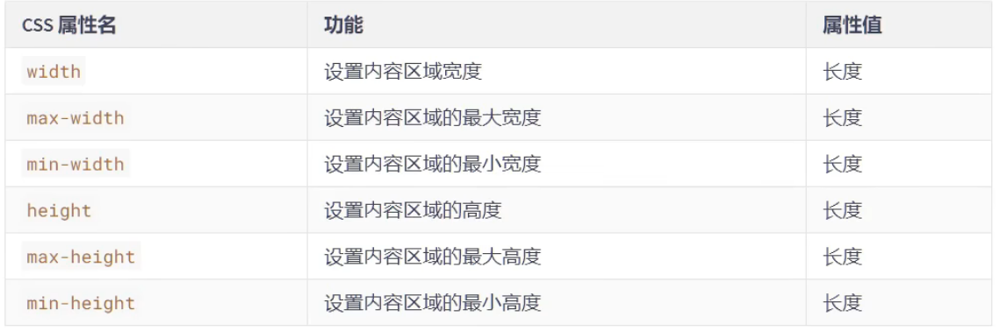
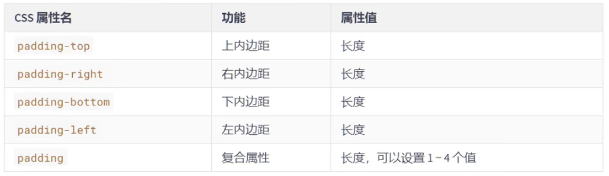
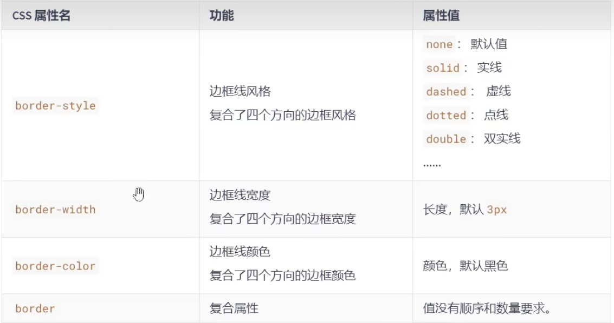
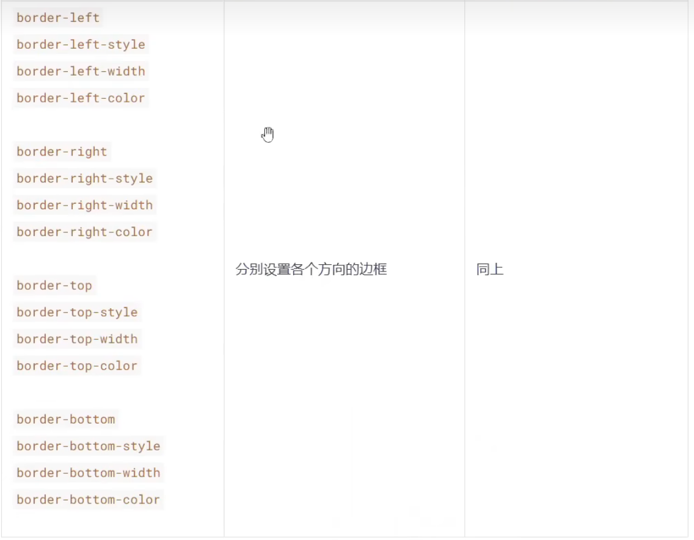
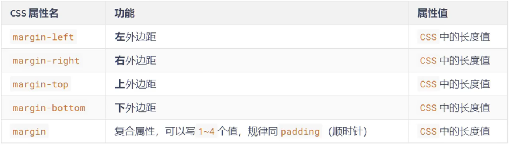
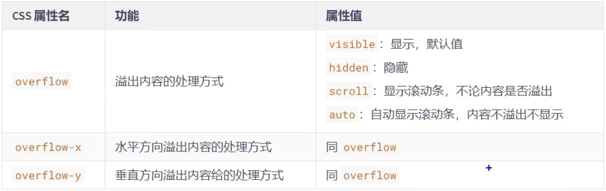

# `CSS`盒子模型

## 一、`CSS`长度单位

1. `px`：像素
2. `em`：相对元素`font-size`的倍数
3. `rem`：相对于根(`root`)字体大小，`html`标签就是根
4. `%`：相对父元素计算

> 注意：`CSS`中设置长度，必须加单位，否则样式无效！


## 二、元素显示模式

### 1、块元素（`block`）

>又称：块级元素
>
>特点：
>
>1. 在页面中==独占一行==，不会与任何元素共用一行，是从上往下排列的
>2. 默认宽度：撑满整个==父元素==
>3. 默认高度：由==内容==撑开
>4. 可以用过`CSS`设置宽高


### 2、行内元素（`inline`）

> 又称：内联元素
>
> 特点：
>
> 1. 在页面中==不独占一行==，一行中不能容纳下的行内元素，会在下一行继续从左到右排列
> 1. 默认宽度：由==内容==撑开
> 1. 默认高度：由==内容==撑开
> 1. 无法通过`CSS`设置高度


### 3、行内块元素（`inline-block`）

> 又称：内联块元素
>
> 特点：
>
> 1. 在页面中==不独占一行==，一行中不能容纳下的行内元素，会在下一行继续从左到右排列
> 1. 默认宽度：由==内容==撑开
> 1. 默认高度：由==内容==撑开
> 1. 可以通过`CSS`设置宽高


注意：元素早期只分为：**行内元素、块级元素**，区分条件也只有一条：“是否独占一行”，如果按照这种分类方式，行内块元素应该算作行内元素


## 三、总结各元素的显示模式

- 块元素（`block`）

	> 1. 主体结构标签：`<html>`、`<body>`
	> 2. 排版标签：`<h1>~<h6>`、`<hr>`、`<p>`、`<pre>`、`<div>`
	> 3. 列表标签：`<ul>`、`<ol>`、`<li>`、`<dl>`、`<dt>`、`<dd>`
	> 4. 表格相关标签：`<table>`、`<tbody>`、`<thead>`、`<tfoot>`、`<tr>`、`<caption>`
	> 5. `<form>`与`<option>`

- 行内元素（`inline`）

	> 1. 文本标签：`<br>`、`<em>`、`<strong>`、`<sup>`、`<sub>`、`<del>`、`<ins>`
	> 2. `<a>`与`<label>`

- 行内块元素（`inline-block`）

	> 1. 图片：``
	> 2. 单元格：`<th>`、`<td>`
	> 3. 表单控件：`<input>`、`<textarea>`、`<select>`、`<button>`
	> 4. 框架标签：`<iframe>`


## 四、修改元素显示模式

通过`CSS`中的`display`属性可以修改元素的默认显示模式，常用值如下：



- 举例：

```css
    <style>
        div {
            /* 修改div的显示模式 */
            display: inline-block;
        }
    </style>
```


## 五、盒子模型的组成

`CSS`会把所有的`html`元素看成一个**盒子**，所有的样式也都是基于这个**盒子**

1. `margin`（**外边框**）：盒子与外界的距离
2. `border`（**边框**）：盒子的边框
3. `padding`（**内边距**）：紧贴内容的补白区域
4. `content`（**内容**）：元素中的文本或后代元素都是它的内容

图示如下：

	

**盒子大小** = `content` + **左右**`padding` + **左右**`border`

> 注意：外边距`margin`不会影响盒子的大小，但会影响盒子的位置

- 举例：

	```css
	    <style>
	        div {
	            /* 内容区的宽 */
	            width: 10em;
	            /* 内容区的高 */
	            height: 10em;
	            /* 内边距，设置的背景颜色会填充内边距区域 */
	            padding: 5px;
	            /* 边框，设置的背景颜色会填充边框区域 */
	            border: 3px red solid;
	            /* 外边距 */
	            margin: 2em;
	        }
	    </style>
	```

	

## 六、盒子内容区（`content`）



> 注意：
>
> `max-width`、`min-width` 一般不与`width`一起使用
>
> `max-height`、`min-height` 一般不与`height`一起使用


## 七、关于默认宽度

所谓的默认宽度，就是不设置`width`属性时，元素所呈现出来的宽度

- 针对块级元素

	**总宽度** = 父的`content` - 自身的左右`margin`

	**内容区宽度** = 父的`content` - 自身的左右`margin` - 自身的左右`border` - 自身的左右`padding`

​		

## 八、盒子内边框（`padding`）



`padding`复合属性的使用规则：

```css
        /* 复合内边距：只写一个值，表示四个方向都是10px */
        padding: 10px;
        /* 写两个值，表示上下10px，左右20px */
        padding: 10px 20px;
        /* 写三个值，表示上10px，左右20px，下30px */
        padding: 10px 20px 30px;
        /* 写四个值，表示上10px，右20px，下30px，左40px */
        padding: 10px 20px 30px 40px;
```

> 注意点：
>
> 1. `padding`的值不能为**负数**
>
> 2. **行内元素**的**左右**内边距是没问题的，**上下**内边距不能完美的设置
> 3. **块级元素、行内块元素**，四个方向**内边距**都是可以完美设置


## 九、盒子边框（`border`）





- 示例

```css
            /* 边框 */
            border-width: 20px;
            border-color: aqua;
            border-style: solid;

            border: 3px red solid;

            border-left: 20px dotted yellow;
            border-left-color: blanchedalmond;
            border-left-width: 30px;
            border-left-style: dashed;

            border-right: 20px purple solid;
            border-right-color: green;
            border-right-width: 40px;
            border-right-style: double;

            border-top: 30px dotted salmon;
            border-top-color: blueviolet;
            border-top-width: 60px;
            border-top-style: solid;

            border-bottom: 10px dashed pink;
            border-bottom-color: burlywood;
            border-bottom-width: 80px;
            border-bottom-style: dotted;
```

> 边框相关属性共20个
>
> `border-style`、`border-width`、`border-color`其实也是复合属性


## 十、盒子外边距（`margin`）



### `margin`注意事项

> 1. 子元素margin，是参考父元素的`content`计算的。（因为是父亲的`content`中承装着子元素）
> 2. 上`margin`、左`margin`：影响自己的位置；下`margin`、右`margin`：影响后面兄弟元素的位置
> 3. 块级元素、行内块元素，均可以完美地设置四个方向的`margin`；但行内元素，左右`margin`可以完美设置，上下`margin`设置无效
> 4. `margin`的值也可以是`auto`，如果给一个**块级元素**设置左右`margin`都为`auto`，该块级元素会在父元素中水平居中
> 5. `margin`的值可以为负值


### `margin`塌陷问题

​		**1.** 什么是`margin`塌陷？

​				第一个子元素的**上**`margin`（`margin-top`）会作用在父元素上，最后一个子元素的**下**`margin`（`margin-bottom`）会作用在				父元素上

​		**2.** 如何解决`margin`塌陷？

​				:one:方案一：给父元素设置不为0的`padding`

​				:two:方案二：给父元素设置宽度不为0的`border`

​				:three:方案三：给父元素设置`CSS`样式`overflow: hidden;`


### `margin`合并问题

​		**1.** 什么是`margin`合并？

​		上面兄弟元素的**下外边距**和下面兄弟元素的**上外边距**会合并，取一个最大的值，而不是相加

​		**2.** 如何解决`margin`塌陷？

​		无需解决，布局的时候上下的兄弟元素，只给一个设置上下外边距就可以了


## 十一、处理内容溢出



> 注意：
>
> 1. `overflow-x`、`overflow-y`不能是一个`hidden`，一个`visible`，会出错误，实验性属性，不建议使用
> 1. `overflow`常用的值是`hidden`和`auto`，除了能处理溢出的显示方式，还可以解决很多疑难杂症（例如`margin`塌陷问题）


## 十二、隐藏元素的方式

#### 方式一：`visibility`属性

`visitiliby`属性默认值是`show`，如果设置为`hidden`，元素会隐藏
元素看不见了，但还会占有原来的位置（元素的大小依然保持）

#### 方式二：`display`属性

设置`display: none`，就可以让元素隐藏
彻底的隐藏，不但看不见，也不占用任何位置，没有大小宽高


## 十三、样式的继承

有些样式会继承，元素如果本身设置了某个样式，就使用本身设置的样式；但如果本身没有设置某个样式，会从父元素开始一级一级继承（优先继承离得近的祖先元素）

**会继承的`CSS`属性**

> ```
> 字体属性、文本属性（除了`vertical-align`）、文字颜色等
> ```

**不会继承的`CSS`属性**

> ```
> 边框、背景、内边框、外边框、宽高、溢出方式等
> ```

一个规律：能继承的属性，都是不影响布局的，简单说：都是和盒子模型没关系的


## 十四、默认样式

元素一般都有些默认的样式，例如：

 1.  `<a>`元素：下划线、字体颜色、鼠标小手

 2.  `<h1>~<h6>`元素：文字加粗、字体大小、上下外边距

 3.  `<p>`元素：上下外边距

 4.  `<ul>、<ol>`元素：左内边距

 5.  **`body`元素**：`8px`外边距（4个方向）

	......

优先级：**元素的默认样式>继承的样式**，所以如果要重置元素的默认样式，选择器一定要直接选择到该元素


## 十五、布局小技巧

1. 行内元素、行内块元素，可以被父元素当做文本处理

	> 即：可以像处理文本对齐一样，去处理：行内、行内块在父元素中的对齐
	>
	> 例如：`text-align`、`line-height`、`text-indent`等

2. 如何让子元素，在父亲中**水平居中**：

	- 若子元素为**块元素**，给**子元素**加上：`margin: 0 auto;`
	- 若子元素为**行内元素、行内块元素**，给**父元素**加上：`text-align: center`

3. 如何让子元素，在父亲中**垂直居中**：

	- 若子元素为**块元素**，给**子元素**加上：`margin-top`~（可能会出现margin塌陷问题）~，值为：`（父元素content区 - 子元素盒子总高）/ 2`

	- 若子元素为**行内元素、行内块元素**： 

		​			让**父元素**的`height = line-height`，每个**子元素**都加上：`vertical-align: middle;`

		​			补充：若想绝对垂直居中，**父元素**`font-size`设置为`0`


## 十六、元素之间的空白问题

**产生的原因**：

​		行内元素、行内块元素，彼此之间的换行会被浏览器解析为一个空白字符

**解决方案**：

1. **方案一**：去掉换行和空格（不推荐）
2.  **方案二**：给父元素设置`font-size: 0;`，再给需要显示文字的元素，单独设置字体大小（推荐）


## 十七、行内块元素的幽灵空白问题

**产生原因：**

​		行内块元素与文本的基线对齐，而文本的基线与文本最低端之间是有一定距离的

**解决方案：**

1. **方案一：**给行内块设置`vertical-aline`，值不为默认的`baseline`即可，设置为`middle、bottom、top`均可
2. **方案二：**若父元素中只有一张图片，设置图片为`display: block`
3. **方案三：**给父元素设置`font-size: 0;`，如果该父元素内部还有文本，则需单独设置`font-size`


 


