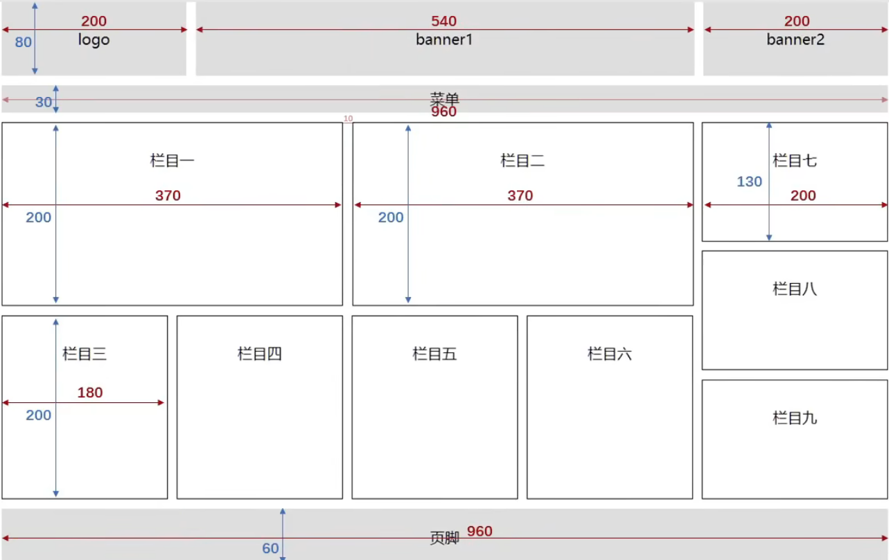

# `CSS`浮动

## 一、浮动简介

在最初，浮动是用来实现文字环绕图片效果的，现在浮动是主流的页面布局方式之一

```css
    <style>
        div {
            background-color: blue;
            width: 800px;
        }
        img {
            width: 200px;
            margin-right: 0.5em;
            /* 让图片左浮动 */
            float: left;
        }
    </style>
```

	


## 二、元素浮动后的特点

1. 脱离文档流
2. 不管浮动前是什么元素，浮动后：默认宽与高都是被内容撑开（尽可能小），而且可以设置宽高
3. 不会独占一行，可以与其他元素共用一行
4. 不会`margin`合并，也不会`margin`塌陷，能够完美的设置四个方向的`margin`和`padding`
5. 不会像行内块一样被当作文本处理（没有行内块的空白问题）


## 三、浮动都会有哪些影响

**对兄弟元素的影响：**后面的兄弟元素，会占据浮动元素之前的位置，在浮动元素的下面；对前面的兄弟无影响

**对父亲的影响：**不能撑起父亲的高度，导致父元素高度塌陷；但父元素的宽度依然束缚浮动的元素


## 四、解决浮动产生的影响

1. 方案一：给父元素指定高度

2. 方案二：给父元素也设置浮动

3. 方案三：给父元素设置`overflow: hidden`

4. 方案四：在所有浮动元素的最后面，添加一个块级元素，并给该块级元素设置clear: both

5. **方案五：**给浮动元素的父元素，设置伪元素，通过伪元素清除浮动，原理与方案四相同——推荐使用

	```css
	.outer::after {
	    content: "";
	    display: block;
	    clear: both;
	}
	```

> 布局中的一个原则：设置浮动的时候，兄弟元素要么全都浮动，要么全都不浮动


## 五、浮动小练习

要求：绘制下图框架




`css`代码

```css
		/* 清除所有元素默认样式 */
        * {
            padding: 0;
            margin: 0;
        }

        /* 左浮动 */
        .leftfix {
            float: left;
        }

        /* 清除浮动带来的影响 */
        .clearfix::after {
            content: "";
            display: block;
            clear: both;
        }
        
        .container {
            width: 960px;
            text-align: center;
            margin: 0 auto;
        }

        .lago,.banner1,.banner2 {
            height: 80px;
            width: 200px;
            background-color: #ccc;
            line-height: 80px;
        }

        .banner1 {
            width: 540px;
            margin: 0 10px;
        }
        
        .menu {
            height: 30px;
            background-color: #ccc;
            margin: 10px 0;
            line-height: 30px;
        }

        .item1,.item2 {
            width: 368px;
            height: 198px;
            line-height: 198px;
            border: 1px black solid;
            margin-right: 10px;
        }

        .top,.body {
            margin-bottom: 10px;
        }

        .item3,.item4,.item5,.item6 {
            width: 178px;
            height: 198px;
            line-height: 198px;
            border: 1px black solid;
            margin-right: 10px;
        }

        .item7,.item8,.item9 {
            width: 198px;
            height: 128px;
            line-height: 128px;
            border: 1px black solid;
        }

        .item8 {
            margin: 10px 0;
        }

        .foot {
            height: 60px;
            background-color: #ccc;
            line-height: 60px;
            /* margin-top: 10px */
        }
```

`html`代码

```html
	<div class="container">
        <!-- 头部 -->
        <div class="head clearfix">
            <div class="lago leftfix">lago</div>
            <div class="banner1 leftfix">banner1</div>
            <div class="banner2 leftfix">banner2</div>
        </div>
        <!-- 菜单 -->
        <div class="menu">菜单</div>
        <!-- 身体 -->
        <div class="body clearfix">
            <!-- 左半部分 -->
            <div class="left leftfix">
                <!-- 左半部分的上半部分 -->
                <div class="top clearfix">
                    <div class="item1 leftfix">栏目一</div>
                    <div class="item2 leftfix">栏目二</div>
                </div>
                <!-- 左半部分的下半部分 -->
                <div class="bottom clearfix">
                    <div class="item3 leftfix">栏目三</div>
                    <div class="item4 leftfix">栏目四</div>
                    <div class="item5 leftfix">栏目五</div>
                    <div class="item6 leftfix">栏目六</div>
                </div>
            </div>
            <!-- 右半部分 -->
            <div class="right leftfix">
                <div class="item7">栏目七</div>
                <div class="item8">栏目八</div>
                <div class="item9">栏目九</div>
            </div>
        </div>
        <!-- 页脚 -->
        <div class="foot">页脚</div>
    </div>
```


