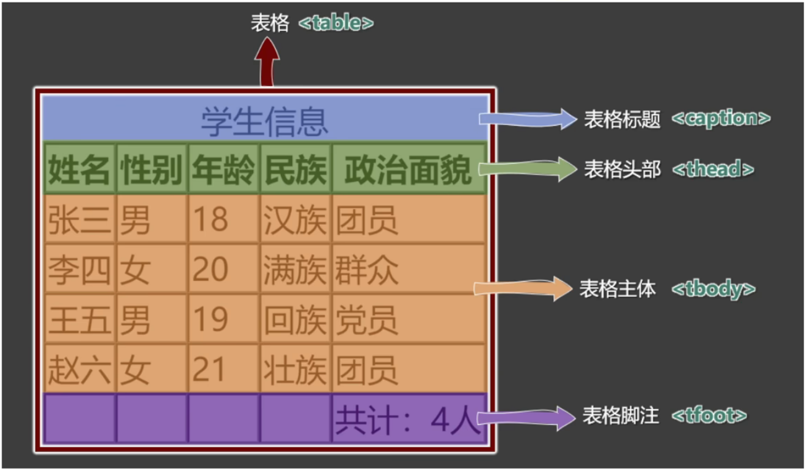
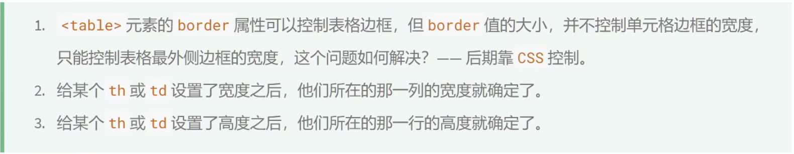

# html标签

两大学习网站链接，可查看HTML各种标签和用法

[w3school](http://www.w3school.com.cn/)

[MDN](https://developer.mozilla.org/zh-CN/)


## 一、排版标签

### 1、标题标签

```html
<!DOCTYPE html>
<html lang="zh-CN">
<head>
    <meta charset="UTF-8">
    <title>html排版标签</title>
</head>
<body>
    <h1>我是一级标题</h1>
    <h2>我是二级标题</h2>
    <h3>我是三级标题</h3>
    <h4>我是四级标题</h4>
    <h5>我是五级标题</h5>
    <h6>我是六级标题</h6>
</body>
</html>
```


标题和标题之间会有空格

标题会自动加粗处理

    <h1>我是一级标题</h1>
    <h2>我是二级标题</h2>
    <h3>我是三级标题</h3>
    <h4>我是四级标题</h4>
    <h5>我是五级标题</h5>
    <h6>我是六级标题</h6>

==注：标题标签不可嵌套==


### 2、段落标签

```html
<p>嘻嘻哈哈</p>
<p>嘻嘻哈哈</p>
<p>嘻嘻哈哈</p>
<p>嘻嘻哈哈</p>
```

段落和段落之间会有空格

段落不会进行任何处理

==注：p标签内部不能出现`h1~h6`，也不能再出现div标签，甚至不能出现p标签==


### 3、包裹标签

```html
<div>
    <p>嘻嘻哈哈</p>
	<p>嘻嘻哈哈</p>
	<p>嘻嘻哈哈</p>
	<p>嘻嘻哈哈</p>
</div>
```

将一部分段落进行包裹处理，方便后期统一整改


## 二、文本标签

注：效果不重要，语义才重要！！！


1. 用于包裹：词汇、短语等
2. 通常写在排版标签里面
3. 排版标签更宏观（大段的文字），文本标签更微观（词汇、短语）
4. 文本标签通常是行内元素。（blockquote   address是块内元素）


```html
	<em>hhhhhh</em>
    <strong>萨满VS</strong>
    <span>嘻嘻hahahaha</span>
```


### **1、常用的**

| 标签名 | 标签语义                         | 单/双标签 |
| ------ | -------------------------------- | --------- |
| em     | 要着重阅读的内容                 | 双        |
| strong | 十分重要的内容（语气比em要强）   | 双        |
| span   | 没有语义，用于包裹短语的通用容器 | 双        |


> 生活中的例子：div是大包装袋，span是小包装袋。


### 2、不常用的


## 三、图片标签

```html

```

src：路径   有相对路径和绝对路径两种写法

alt：用于搜索引擎 或者 图片错误加载不出来时展示的


```html

```

width：图片的宽度

height：图片的高度

二者可以只写一个，等比例缩放


放大界面（vscode和typora都可用）

ctrl+shift+ 加号


`src="./佳强老婆29.jpg"`

==相对路径：==

./  当前位置

../  返回上一级

/  下一级


==绝对路径：==1、本地绝对路径     2、网络绝对路径

1、本地绝对路径：几乎不用

```html
 
```


2、网络绝对路径：通过图片网址访问的图片

```html

```

使用方便，但如果别人开启了防盗链，那么图片将获取失败


## 四、超链接标签

### 1、超链接跳转网页

主要作用：从当前页面进行跳转。

```html
    <!-- 跳转到其他网页 -->
    <a href="https://www.jd.com/" target="_blank"></a>
    <!-- 跳转到本地网页 -->
    <a href="./html图片标签.html" target="_self"></a>
```

- href：要跳转的具体位置

- target：要跳转时如何打开页面，常用值如下：


​    		 ` _blank：在新页面打开`

​			 `_self：在当前页面打开（默认效果）`


注：

1. 代码中的多个空格、多个回车，会被浏览器解析成一个空格
2. 虽然a是行内元素，但a可以包裹除它自身以外的任何元素

`<a href="./html图片标签.html" target="_self">`

​	`<p>嘻嘻哈哈</p>`

`</a>`


### 2、超链接跳转文件

- 能使用超链接直接在浏览器打开的本地文件通常有

.jpg	.mp4	.gif	.pdf	.ico ....

- 不能使用超链接直接在浏览器打开的本地文件通常有

.zip ....

- 也可以跳转到一个在线的网络文件


```html
	 <!-- 跳转文件 -->
	<a href="./favicon.ico" target="_blank">
        
	</a>


	<!-- 点击超链接触发强制下载 -->
    <a href="./佳强老婆29.jpg" target="_blank" download="老婆">
        <h1>下载美女图片</h1>
	</a>
```


`download`：触发强制下载，里面的值对应下载后的文件名   如果为空则默认是原文件名


### 3、超链接跳转锚点

锚点：网页的一个标记点

```html
 	<a href="#mn">点我直接看美女</a>
    <a href="#lp">点我直接看老婆</a>

	<!-- 超链接跳转锚点 用a标签跳转-->
    <a name="mn"></a>
    <p>美女</p>
    

    <!-- 超链接跳转锚点 用其他标签跳转-->
    <p id="lp">老婆</p>
    
```

- 用a标签跳转锚点
	-  `<a name="mn"></a>`
		在a标签中加name属性进行定位
- 用其他标签进行跳转锚点
	- `<p id="lp">老婆</p>`
		用id属性进行定位
		id值最好不要以数字开头
- a标签中 `href` 的值为 #name的值 / #id的值
	- `<a href="#mn">点我直接看美女</a>`
		`<a href="#lp">点我直接看老婆</a>`


也可在其他文件中定位到当前文件中的锚

```html
<a href="./html超链接.html#lp">看看老婆</a>
```

`<a href="./html超链接.html#lp">看看老婆</a>`


```html
	<a href="#">回到开头</a>
    <a href="">刷新界面</a>
	<a href="javascript:alert(666);">点我弹窗</a>
```

当超链接`href`的值为#时，点击回到开头

当超链接`href`的值为空时，点击刷新页面

`href="javascript:alert(666);"`
js的一种弹窗语言 后面会学


### 4、超链接唤起指定应用

```html
	 <!-- 超链接唤起指定应用 -->
    <a href="tel:10001">电话联系</a>
    <a href="mailto:1202121@qq.com">邮箱联系</a>
    <a href="sms:1083918497">短信联系</a>
    <!-- sms：手机短信服务 -->
```

tel：电话

mailto：邮箱

`sms`：手机短信服务


### 5、超文本

超文本：是一种组织信息的方式，通过超链接将不同空间的文字、图片等各种信息组织在一起，能从当前阅读的内容，跳转到超链接所指向的内容。（页面、文件、锚点、应用）


## 五、列表标签

`列表项（List Item)`
 <li></li>

### 1、有序列表

有序列表（Ordered List） <ol></ol>

```html
    <!-- 有序列表（Ordered List） --> 
    <h2>把大象放进冰箱里需要几步</h2>
    <ol>
        <li>打开冰箱门</li>
        <li>把大象放进去</li>
        <li>关上冰箱门</li>
    </ol>
```


### 2、无序列表

无序列表（Unordered List） <ul></ul>

```html
     <!-- 无序列表（Unordered List） -->
    <h2>我想去的城市</h2>
    <ul>
        <li>成都</li>
        <li>上海</li>
        <li>北京</li>
        <li>浙江</li>
    </ul>
```


### 3、自定义列表

自定义列表（Definition List）<dl></dl>

术语标题(Definition Title)   <dt></dt>

术语描述(Definition Descriptive)  <dd></dd>（可多个）

```html
    <!-- 自定义列表（Definition List） -->
    <!-- 术语标题(Definition Title)  术语描述(Definition Descriptive) -->
   <h2>如何更好的学习</h2>
    <dl>
        <dt>做好笔记</dt>
        <dd>笔记是我们以后练习的抓手</dd>
        <dt>多加练习</dt>
        <dd>只有敲出来的代码，才是自己的</dd>
        <dt>被怕出错</dt>
        <dd>错很正常，改正并记住，就是经验</dd>
    </dl>
```


### 4、列表的嵌套

嵌套时，一定要把结构写完整

```html
	<ul>
        <li>成都</li>
        <li>
            <span>上海</span>
            <ul>
                <li>东方明珠</li>
                <li>外滩</li>
                <li>迪士尼乐园</li>
            </ul>
        </li>
        <li>北京</li>
        <li>浙江</li>
    </ul>
```

注：`li` 标签最好写在`ul`或`ol`中，不要单独使用


## 六、表格标签



`table` 表格

`border="1"` 使绘制表格拥有1px的边框线

`caption` 表格标题

`thead` 表格头部 (title head)

`tbody` 表格主体 (title body)

`tfoot` 表格脚注 (title foot)

`tr ` 表格的一行 (title row)

`th` 表格头部使用 表示一个单元格 (title head里面的东西)

`td` 表格主体、脚注使用 表示一个单元格 (title data)

```html
<!-- 表格整体结构 -->
	<table border="1" cellspacing="0">
        <!-- caption 表格标题 -->
        <caption>表格标题</caption>

        <!-- thead 表格头部 -->
        <!-- tr 表格的一行 -->
        <!-- th 表格头部使用 表示一个单元格 -->
        <thead>
            <tr>
                <th>头部单元格</th>
                <th>头部单元格</th>
                <th>头部单元格</th>
                <th>头部单元格</th>
            </tr>
        </thead>

        <!-- tbody 表格主体 -->
        <!-- td 表格主体、脚注使用 表示一个单元格 -->
        <tbody>
            <tr>
                <td>主体单元格</td>
                <td>主体单元格</td>
                <td>主体单元格</td>
                <td>主体单元格</td>
            </tr>
            <tr>
                <td>主体单元格</td>
                <td>主体单元格</td>
                <td>主体单元格</td>
                <td>主体单元格</td>
            </tr>
            <tr>
                <td>主体单元格</td>
                <td>主体单元格</td>
                <td>主体单元格</td>
                <td>主体单元格</td>
            </tr>
        </tbody>

        <!-- tfoot 表格脚注 -->
        <tfoot>
            <tr>
                <td></td>
                <td></td>
                <td></td>
                <td>脚注单元格</td>
            </tr>
        </tfoot>
    </table>
```




`<table>`里的`width`可以理解为表格宽度最大值

​						`height`可以理解为表格高度最小值


单元格跨行跨列标签

rowspan：指定要跨的行数

colspan：指定要跨的列数

```html
	<thead>
        <tr>
            <th>项目</th>
            <th colspan="5">上课</th>
            <th rowspan="2">活动与休息</th>
        </tr>
    </thead>
```


## 七、一些常用的简单标签

### 1、换行标签`<br>`

```html
	<!-- 换行标签<br> -->
    <a href="https://www.baidu.com">去百度</a>
    <br>
    <a href="https://www.jd.com">去京东</a>
```

### 2、分割线标签`<hr>`

```html
	<!-- 分割线<hr> -->
    <div>第一章</div>
    <p>哈哈哈哈哈哈哈哈哈</p>
    <hr>
    <div>第二章</div>
    <p>嘻嘻嘻嘻嘻嘻嘻嘻</p>
```

### 3、按原文显示标签`<pre></pre>`

一般用于在网页中嵌入大量代码

```html
    <!-- 按原文显示<pre></pre> -->
    <pre>
        I       love       you
            I   love    you 
                love
    </pre>
```


## 八、表单标签

### 1、表单标签`<form></form>`

`action`(行动)：用于指定表单提交地址（不同一个地址所提交的内容不一样，需要与后端人员沟通确定）

`target`(目标)：_blank表示在新的窗口打开

​				 		  _self表示在原来的窗口打开（默认结果）

`method`(方法)：用于表单提交方式，主要有`get`  `post` 方式

```html
	<form action="https://www.baidu.com/s">
        <input type="text" name="wd">
        <button>去百度</button>
    </form>

	<form action="https://search.jd.com/search" target="_blank" method="get">
        <input type="text" name="keyword">
        <button>去京东搜索</button>
    </form>
```


### 2、输入框标签<`input`>

#### 普通输入框

`type`：设置输入框的类型，默认值为text

- `text`：表示普通文本

- `password`(密码)：表示密码文本
- `radio`：表示单选框
- `checkbox`：表示多选框
- `hidden`：表示隐藏域
- `submit`：表示提交按钮

`name`：同于指定提交数据的名字（不同一个地址所提交的内容不一样，需要与后端人员沟通确定）

`value`：表示输入框中的默认值 （密码一般不用 没有意义）

`maxlength`：表示输入框最大可输入长度

```html
	<form action="https://search.jd.com/search">
        <!-- 文本输入框 -->
        账户：<input type="text" name="account" value="ljqiang" maxlength="10"><br>
        <!-- 密码输入框 -->
        密码：<input type="password" name="pwd" value="123" maxlength="8"><br>
        <button>确认</button>
    </form>
```


#### 单/多选框

`checked`：表示让该单/多选框默认选中

```html
		<!-- 单选框 -->
		性别：
        <input type="radio" name="gender" value="male">男
        <input type="radio" name="gender" value="female" checked>女<br>
		<!-- 多选框 -->
        爱好：
        <input type="checkbox" name="hobby" value="smoke" checked>抽烟
        <input type="checkbox" name="hobby" value="drink">喝酒
        <input type="checkbox" name="hobby" value="perm">烫头<br>
```

注：同一组单选框或多选框中的name值要保持一致


#### 隐藏域

用户不可见的一个输入区域

```html
        <!-- 隐藏域 -->
        <input type="hidden" name="from" value="baidu">
```

作用：提交表单的时候，携带一些固定的数据


### 3、按钮写法

#### 提交按钮

```html
        <!-- 确认按钮的第一种写法 -->
        <button >确认</button>
		<button type="submit>确认</button>
        <!-- 确认按钮第二种写法 -->
        <input type="submit" value="确认">
```

- `<button>确认</button>`
- `<input type="submit" value="确认">`

`submit`：提交


注：type值为submit的输入框表示为按钮，value值为按钮上的文字，默认为提交，不要写name属性


#### 重置按钮

```html
        <!-- 重置按钮的第一种写法 -->
        <button type="reset">重置</button>
        <!-- 重置按钮的第二种写法 -->
        <input type="reset" value="刷新">
```

-  `<button type="reset">重置</button>`
- `<input type="reset" value="刷新">`


#### 普通按钮

```html
 		<!-- 普通按钮 第一种写法-->
        <button type="button">点我无效 普通按钮</button>
        <!-- 普通按钮 第二种写法-->
        <input type="button" value="点我无效 普通按钮">
```

- `<button type="button">点我无效 普通按钮</button>`
- `<input type="button" value="点我无效 普通按钮">`


### 4、文本域

```html
		<!-- 文本域 -->
        其他：
        <textarea name="other" cols="23" rows="3"></textarea><br>
```

`textarea`：文本域标签

- `name`：文本域名字
- `rows`：默认显示行数，会影响文本域高度
- `cols`：默认显示列数，会影响文本域宽度
- 不能写`type`属性，其他属性 和普通文本框一样


### 5、下拉框

```html
		<!-- 下拉框 -->
		籍贯：
        <select name="play">
            <option value="吃">零食</option>
            <option value="喝">饮料</option>
            <option value="玩" selected>旅游</option>
            <option value="乐">开玩笑</option>
        </select>
```

`select`（选择）：下拉框标签

- `name`：下拉框名字

- `option`（选择）
	- `value`：提交时`select`中的`name`所对应的值，没设置就默认`option`中间的文字
	- `selected`：设置在`option`内部  表示默认选中


### 6、禁用表单控件

在各个标签内添加`disabled`即可禁用表单控件

```html
<input disabled type="text" name="account" value="ljqiang" maxlength="10">
<textarea disabled name="other" cols="23" rows="3"></textarea>
<option disabled value="喝">饮料</option>
<button disabled type="button">点我无效 普通按钮</button>
```


### 7、`label`标签

`label(标签)`标签可与表单控件相关联，关联之后点击文字，与之对应的表单控件就会获取焦点

```html
        性别：
        <input type="radio" name="gender" value="male" id="man">
        <label for="man">男</label>
        <label>
            <input type="radio" name="gender" value="female"> 女
        </label>
```

`label`标签的两种关联方法

- 让`label`标签的`for`属性的值等于表单控件的`id`

	`<input type="radio" name="gender" value="male" id="nan">`
	`<label for="nan">男</label>`

- 把表单控件套在`label`标签里

​		`<label>`
​            `<input type="radio" name="gender" value="female"> 女`
​        `</label>`


### 8、表单中的`fieldset`与`legend`

```html
		<!-- 主要信息 -->
        <fieldset>
            <legend>主要信息</legend>
            <!-- 文本输入框 -->
            <label for="zhanghu">账户：</label>
            <input type="text" name="account" value="ljqiang" maxlength="10" id="zhanghu">
        </fieldset>
```

`fieldset`：（字段集）可以为表单控件进行分组

`legend`：（传说）表示分组的标题


## 九、框架标签

`iframe`（框架）：框架标签

- `src`：框架内会呈现的内容的地址/网址
- `name`：框架名字，可以和`target`属性配合
- `width`：框架的宽
- `height`：框架的高度
- `frameborder`：是否显示边框，值为0/1  1表示显示边框  0表示不显示边框

```html
	<!-- 利用iframe嵌入一个淘宝网页 -->
    <iframe src="https://www.taobao.com" frameborder="0" width="300" height="300"></iframe><br>

    <!-- 利用iframe嵌入其他内容 -->
    <iframe src="./favicon.ico" frameborder="1"></iframe><br>

    <!-- iframe与超链接target属性配合使用 -->
    <a href="https://www.taobao.com" target="taobao">点我去淘宝</a><br>
    <iframe name="taobao" frameborder="0" width="900" height="300"></iframe><br>

    <!-- iframe与表单的target属性配合使用 -->
    <form action="https://so.toutiao.com/search" target="tb">
        <input type="text" name="keyword">
        <input type="submit" value="搜索">
    </form><br>
    <iframe name="tb" frameborder="1" width="900" height="300"></iframe>
```

`inframe`作用

1. 在网页中嵌入广告
2. 与超链接或表单的`target`配合，展示不同的内容


## 十、`meta`元信息

### 1、配置字符编码

```html
	<!-- 配置字符编码 -->
    <meta charset="UTF-8">
```


### 2、配置移动端

```html
	<!-- 针对移动端的一个配置 -->
    <meta name="viewport" content="width=device-width, initial-scale=1.0">
```


### 3、配置网页中的关键字

```html
	<!-- 配置网页中的关键字 逗号必须是英文版的-->
    <meta name="keywords" content="网上购物,电商购物,皮鞋">
```

- 关键字与关键字之间用==英文版的逗号==隔开


### 4、配置网页描述信息

```html
	<!-- 配置网页描述信息 -->
    <meta name="Description" content="哈哈购物网成立于2001年...">
```


### 5、网页自动跳转

```html
	<!-- 自动刷新 -->
    <meta http-equiv="refresh" content="3;url=https://www.baidu.com">
```

- `content="3;url=https://www.baidu.com`
	表示停留3秒后，自动跳转后面的网址
- 跳转后无法回到原页面


### 6、配置搜索引擎爬虫

````html
	<!-- 配置搜索引擎爬虫 -->
    <meta name="robots" content="此处的值见下表">
````


### 7、配置网页作者

```html
	<!-- 配置网页作者 -->
    <meta name="Author" content="tony">
```


### 8、配置网页生成工具

```html
	<!-- 配置网页生成工具 -->
    <meta name="generator" content="Visual Studio Code">
```


### 9、配置定义网页版权信息

````html
	<!-- 配置定义网页版权信息 -->
    <meta name="copyright" content="2023-2027&copy;版权所有">
````


### 10、针对`IE`浏览器的兼容性配置

```html
	<!-- 针对IE浏览器的兼容性配置 -->
    <meta http-equiv="X-UA-Compatible" content="IE=edge">
```


### 11、完整网页元信息

[完整网页元信息](https://developer.mozilla.org/zh-CN/docs/Web/HTML/Element/meta)


