# `html5`新增语义化标签

## 一、新增布局标签

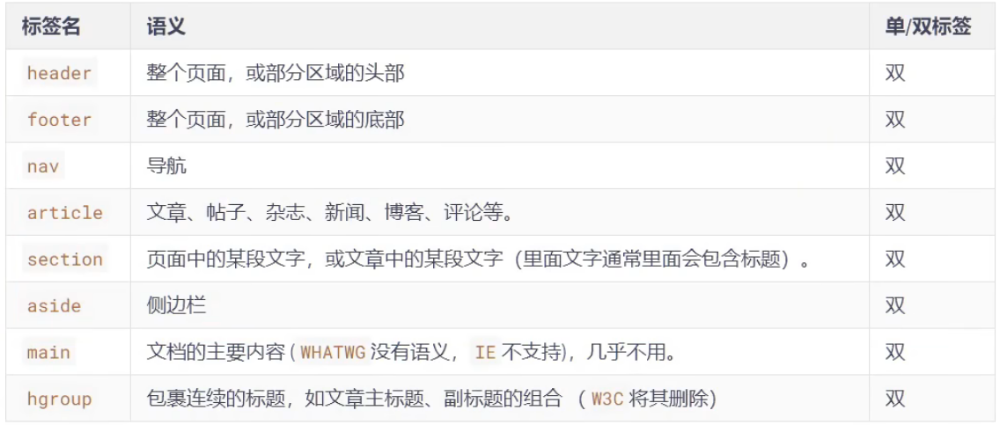

关于`article`和`section`：

> 1. `article`里面可以有多个`section`
> 2. `section`强调的是分段或多段，如果你想将一块内容分成几段的时候，可使用`section`元素
> 3. `article`比`section`更强调独立性，一块内容如果比较独立、比较完整，应该使用`article`元素


注：这些标签本质其实都是`div`标签一样的用法，只是比`div`标签更附有**语义化**


## 二、新增状态标签

### 1、`meter`标签

- 语义：定义已知范围内的标量测量。也被成为`guage`（尺度），双标签，例如：电量、磁盘用量等

- 常用属性如下：

	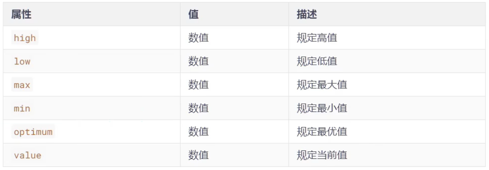

- ```html
	<meter max="100" min="0" value="90" high="20" low="10" optimum="80"></meter>
	```

- 效果：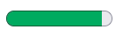

### 2、`progress`标签

- 语义：显示某个任务完成的进度的指示器，一般用于表示进度条，双标签，例如：工作完成进度等

- 常用属性如下：

	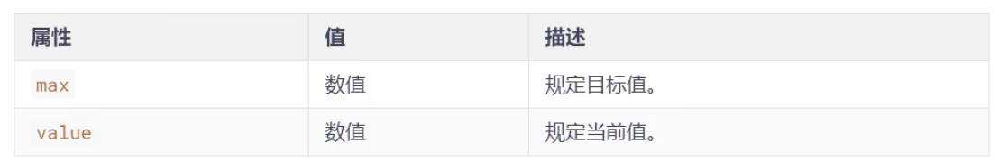

- ```html
	<progress max="100" value="10"></progress>
	```

- 效果：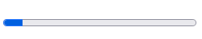 


## 三、新增列表标签

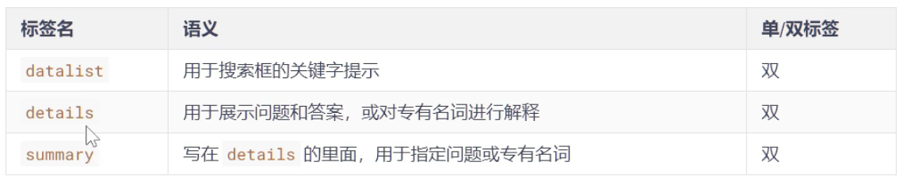

### 1、`datalist`用法

```html
	<!-- datalist和input关联，实现类似下拉框搜索效果 -->
	<input type="text" list="data">
    <datalist id="data">
        <option value="周杰伦">周杰伦</option>
        <option value="周雨彤">周雨彤</option>
        <option value="马冬梅">马冬梅</option>
        <option value="周冬雨">周冬雨</option>
    </datalist>
```

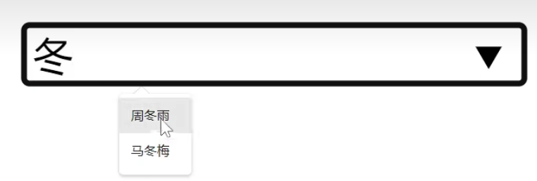 

### 2、`details`用法

```html
	<!-- details必须和summary搭配使用 -->
	<details>
        <summary>如何一夜暴富</summary>
        <p>学习学习学习学习学习学习</p>
    </details>
```

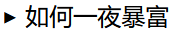 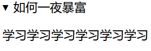 


## 四、新增文本标签

### 1、文本注音`ruby`

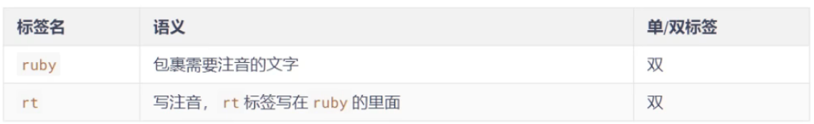

```html
	<ruby>
        <span>魑魅魍魉</span>
        <!-- rt 标签必须放在文本下面才能注上拼音 -->
        <rt>chī mèi wǎng liǎng</rt>
    </ruby>
```


### 2、文本标记`mark`

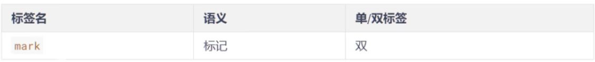

> 注意：`W3C`建议`mark`用于标记搜索结果中的关键字


