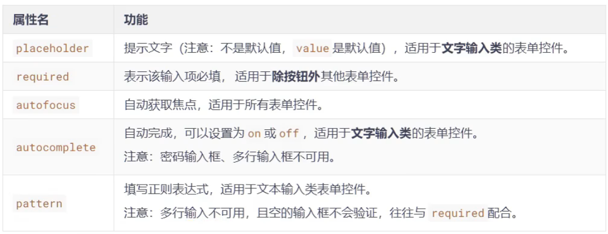

# 新增表单功能



```html
	<form action="#">
        账号：
        <input 
            type="text"   
            name="account" 
            required               //必填项
            placeholder="请输入账号" 		//提示语句
            autofocus 			//自动焦点
            autocomplete="on" 		//记录之前用过的值
            pattern="\W{6}"		//只接收字母 数字和“_”类型数据，且必须输入6位
        >
        <br>
        密码：
        <input type="password" name="pwd">
        <button>提交</button>
    </form>
```


表单也有一个新增的属性`novalidate`可以让表单所有的效验规则都不生效

```html
	<form action="#" novalidate>
        账号：
        <input type="text" name="account" required>		//添加了novalidate后所有的效验规则都不生效。如required
        <br>
        密码：
        <input type="password" name="pwd">
        <button>提交</button>
    </form>
```

